# 南开大学 计算机研究生 计算机网络 分题型速成

## 考试形式：闭卷，25选择(2分一道)+5道简答(10分一道)

### 背景介绍

由于南开大学 计算机研究生 计算机网络课程的PPT很难复习，而且和考试不是直接相关，而真题非常难获取，资料都很老旧。

所以我根据资料自己总结了复习题。资料上的真题虽然老旧，但还是有一定参考价值，称之为**潜在真题**。

对于潜在真题，不仅需要知道答案，对于关键点还需要有一个**简单理解**。简单理解要很短，可以有一些简化（而无需保持绝对严谨），最好用举例形式，例如，DNS：查询`www.baidu.com`对应的百度ip。简单理解不一定会考，但是可以帮助记忆。

有一些题型只是背概念可能还不够，这类题含有一定情景、需要动手画一画，但是又缺乏真题，比方说CRC校验；还有一些题有一套系统的知识点，但是只考了一个点，需要举一反三。我对于这类题自己增加了**模拟真题**。

值得注意的是：有些不同年份的学长回忆是相同的，比如2016年和2018年的回忆都考了子网划分，对于重复的回忆，我进行了一个集合合并，让复习资料尽量**不重不漏**。

### 目录

[TOC]

- [南开大学 计算机研究生 计算机网络 分题型速成](#南开大学-计算机研究生-计算机网络-分题型速成)
  - [考试形式：闭卷，25选择(2分一道)+5道简答(10分一道)](#考试形式闭卷25选择2分一道5道简答10分一道)
    - [背景介绍](#背景介绍)
    - [目录](#目录)
    - [文档格式约定](#文档格式约定)
    - [潜在真题：课上发的选择题](#潜在真题课上发的选择题)
    - [潜在真题：HTTP和DNS协议，递归解析和反复解析](#潜在真题http和dns协议递归解析和反复解析)
    - [模拟真题：HTTP 协议的请求方法、版本、状态码](#模拟真题http-协议的请求方法版本状态码)
    - [模拟真题：DNS 递归解析和反复解析的流程图](#模拟真题dns-递归解析和反复解析的流程图)
    - [潜在真题：C/S和P2P协议对比，套接字编程的关键字](#潜在真题cs和p2p协议对比套接字编程的关键字)
    - [模拟真题：Socket 编程的所有经典函数](#模拟真题socket-编程的所有经典函数)
    - [潜在真题：CRC和CheckSum的描述（学长回忆补全版）](#潜在真题crc和checksum的描述学长回忆补全版)
    - [模拟真题：CRC与Checksum的计算](#模拟真题crc与checksum的计算)
    - [潜在真题：要求背出TCP和UDP两大协议的特征](#潜在真题要求背出tcp和udp两大协议的特征)
    - [潜在真题：Wireshark 报文分析](#潜在真题wireshark-报文分析)
    - [模拟真题：TCP 三次握手与四次挥手](#模拟真题tcp-三次握手与四次挥手)
    - [潜在真题：子网掩码、网络地址和广播地址](#潜在真题子网掩码网络地址和广播地址)
    - [模拟真题：CIDR 与子网划分](#模拟真题cidr-与子网划分)
    - [潜在真题：ABCDE类IP地址与子网划分（学长回忆补全版）](#潜在真题abcde类ip地址与子网划分学长回忆补全版)
    - [模拟真题：子网划分大题](#模拟真题子网划分大题)
    - [潜在真题：TCP 报文首部分析（学长回忆补全版）](#潜在真题tcp-报文首部分析学长回忆补全版)
    - [模拟真题：IPv4 报文首部分析](#模拟真题ipv4-报文首部分析)
    - [潜在真题：以太网帧结构分析（学长回忆补全版）](#潜在真题以太网帧结构分析学长回忆补全版)
    - [潜在真题：FTP、SNMP、POP3协议（学长回忆补全版）](#潜在真题ftpsnmppop3协议学长回忆补全版)
    - [第一套选择题（25道，50分）](#第一套选择题25道50分)
    - [第二套选择题（25道，50分）](#第二套选择题25道50分)

### 文档格式约定

- **简答题**：复述题目（含分值），简单回答（不拖泥带水），关键字加粗。
- **选择题**：复述题目（含分值），简单分析，给出答案选项，关键字加粗。
- **简单理解**：只用一句话，描述一个例子来简单地理解一个概念，无需保持绝对严谨，不要用比喻等修辞手法。如果概念是中文的，例如`网络层`就不要添加英文全称，如果是英文简写，例如`UDP`，就添加一个英文全称。
- **模拟真题**：仿照简答/选择题出题。

分段之间用 --- 隔开

---

### 潜在真题：课上发的选择题

>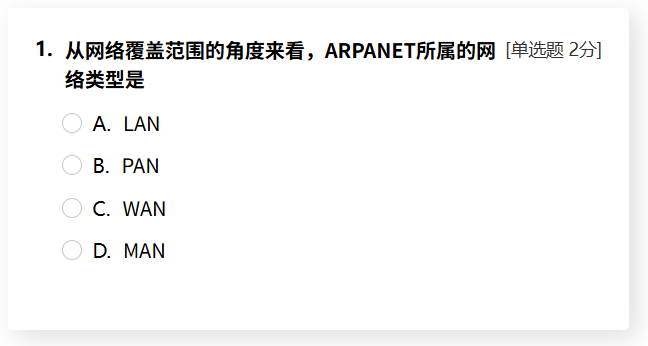
>
>**选择题**：
>
>**从网络覆盖范围的角度来看, ARPANET所属的网络类型是 (单选题 2分)**
>
>- A. LAN
>- B. PAN
>- C. WAN
>
>- D. MAN
>
>**选项分析**：
>ARPANET 是连接美国各地大学和研究机构的网络，其**地理覆盖范围非常广**，跨越了城市和州，这完全符合**广域网 (WAN)** 的定义。LAN（局域网）、MAN（城域网）和 PAN（个域网）的覆盖范围都远小于 ARPANET。
>
>**答案选项**：**C**

---

**简单理解 各种网**：

*   **ARPANET**(Advanced Research Projects Agency Network)：美国开发的第一个**分组交换**网络，是互联网（**Internet**）的前身。
*   NSFNET(National Science Foundation Network)：美国国家科学基金会建立的，用于连接各大学计算机，替代了ARPANET(PPT上的，似乎没有考过)。
*   ANSNET(Advanced Network and Services Network)：接替 NSFNET (PPT上的，似乎没有考过)。
*   **体域网(BAN)** (Body Area Network)：佩戴在身上的智能手表、血糖监测仪等设备组成的一个微型网络。
*   **个域网 (PAN)**(Personal Area Network)：用蓝牙技术将你的手机、耳机和智能手表连接起来组成的微型网络。
*   **局域网 (LAN)**(Local Area Network)：一个办公室或家庭内的所有电脑和打印机通过路由器连接起来组成的网络。
*   **城域网 (MAN)**(Metropolitan Area Network)：连接一个城市内不同校区或企业分支机构的网络，例如南开大学八里台校区和津南校区的互联网络。
*   **广域网 (WAN)**(Wide Area Network)：一家跨国公司连接其北京、上海和纽约办公室的内部专用网络。
*   **传输网**：由光纤(**光传输网**)、交换机等底层设施构成的，负责在城市或国家之间高速传输数据的物理网络。
*   **以太网**：将你的台式电脑用一根网线（水晶头）插到墙上或路由器上进行有线联网的技术。
*   **万维网 (WWW)**(World Wide Web)：通过浏览器访问网页（如 `www.nankai.edu.cn`）和超链接。
*   **有线网**：通过网线将电脑连接到路由器上网。
*   **无线网**：笔记本电脑或手机通过 Wi-Fi 连接到互联网。
* **电信网 (Telecommunication Network)**：由运营商（如中国移动）建立的，能让你打电话、发短信和用手机流量上网的整个网络。

---

> 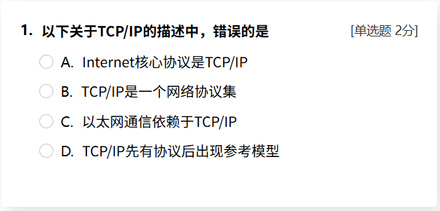
>
> **选择题**：
>
> **以下关于TCP/IP的描述中，错误的是 (单选题 2分)**
>
> - A. Internet核心协议是TCP/IP
> - B. TCP/IP是一个网络协议集
> - C. 以太网通信依赖于TCP/IP
> - D. TCP/IP先有协议后出现参考模型
>
> **选项分析**：
> 以太网工作在**数据链路层**（第二层），而 TCP/IP 工作在**网络层和传输层**（第三、四层）。以太网负责在局部网络中传输数据帧，它可以承载 TCP/IP 协议的报文，但**其本身并不依赖于 TCP/IP**，它也可以承载其他网络层协议。因此，"依赖于" 的说法是错误的。A、B、D 均为正确描述。
>
> **名词解释**：
>
> 参考模型：此题特指在协议实践后总结出来的**TCP/IP模型**
>
> 网络协议集：含多个网络协议的集合。
>
> **答案选项**：**C**

---

**简单理解：OSI七层模型**

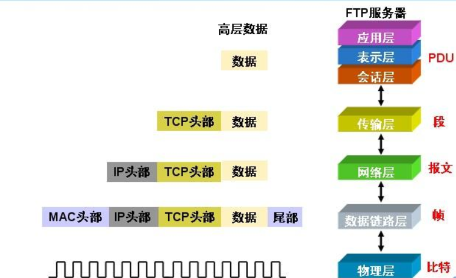

*   **物理层**：将电脑要发送的数据转换成0和1的**比特**流，并通过网线上的高低电压或者光纤中的光亮暗来传输。
*   **数据链路层**：将比特流打包成**帧**，并附上**MAC**地址，确保数据能在同一个局域网内的两台设备之间正确传递。
*   **网络层**：将数据封装成带有源和目的**IP**地址的报文，路由器根据这个IP地址选择路径，把报文从一个网络转发到另一个网络。
*   **传输层**：为数据分配一个**端口**号以区分不同程序（如浏览器用80端口，微信用其他端口）的数据，并负责管理**端到端**的可靠传输。
*   **会话层**：负责建立、管理和终止应用程序间的通信会话，例如在你进行网络视频通话时，它能确保通话连接在挂断前一直保持。
*   **表示层**：负责数据的格式转换、加密和压缩，例如当你访问银行网站时，它会将你输入的密码加密成一串乱码再发送出去。
*   **应用层**：为用户程序提供各种服务，例如你的浏览器使用HTTP协议向服务器请求并显示一个网页。

**记忆方法**：物联网叔会使用，意思是叔叔会使用物联网。

物(**物**理层)  -  联(数据**链**路层)  -  网(**网**络层)  -  叔(传**输**层)  -  会(**会**话层)  -  使(表**示**层)  -  用(应**用**层)。

**简单理解：计网基础概念**

*   **IP地址 (Internet Protocol)**：互联网上每台设备的唯一地址，你的电脑访问百度网站时，就是向百度的服务器IP地址（如`39.156.66.10`）发送请求。
*   **MAC地址 (Media Access Control)**：每个网卡的唯一身份证号，有6字节，比如 00-0C-29-4F-8B-35。
*   **端口号**：用于区分同一台设备上不同网络程序的数据，例如，你的电脑同时用浏览器访问网页和用微信聊天，端口号可以确保网页数据被正确地交给浏览器，而不是微信。

---

**简单理解：各种协议**

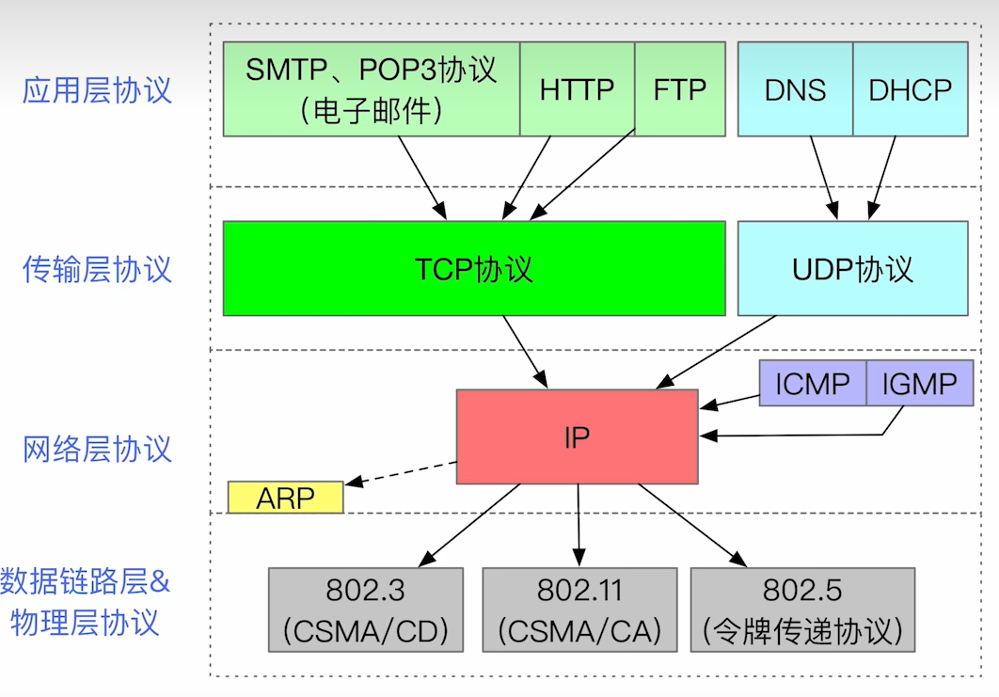

- **数据链路层**
  - **IEEE 802.3**: 将你的台式电脑用一根网线（水晶头）插到墙上或路由器上进行**有线**联网的技术标准。
  - **IEEE 802.11**: 你的笔记本电脑或手机通过 Wi-Fi 连接到**无线**路由器上网所使用的技术标准。**记忆方法**：11很像是Wi-Fi的两个i。
  - **CSMA/CD** (Carrier Sense Multiple Access with Collision Detection): **有线**网中，多台电脑先听网络有没有人在说话（Carrier Sense），没人说就说（Multiple Access），如果同时说（Collision）就都停下，随机等一会再说（**Collision Detection**）。
  - **CSMA/CA** (Carrier Sense Multiple Access with Collision Avoidance): **无线**网中，设备先听信道是否空闲，并且在发送前先发一个短信号预约信道，尽量避免（**Avoidance**）数据碰撞。**记忆方法**：无线网没有有线网信号稳，所以需要预约信道。
  - **ARP** (Address Resolution Protocol): 在局域网内，通过广播询问“IP地址是192.168.1.100的设备，你的**MAC**地址是多少？”来找到目标设备的物理地址。
  - **RARP** (Reverse Address Resolution Protocol): 一台刚开机的设备只知道自己的MAC地址，通过广播询问“我的MAC地址是XX:XX:XX:XX:XX:XX，谁能告诉我我的**IP**地址是什么？”。**记忆方法**：ARP增加了一个R，表示**反向**(Reverse)。
- **网络层**
  - **IP** (Internet Protocol): 给每个数据包贴上**源和目的IP**地址，确保它能在互联网上被路由器正确转发。
  - **ICMP** (Internet Control Message Protocol): 使用**ping**命令(`ping www.baidu.com`)时，你的电脑发送一个ICMP请求，百度服务器回复一个ICMP应答，来测试网络是否连通或报告错误。
  - **IGMP** (Internet Group Management Protocol): 你想看网络电视直播（组播）时，你的电脑通过IGMP告诉路由器“请把CCTV5的视频流发给我”，从而**加入这个直播组**。
  - **RIP** (Routing Information Protocol): 一个小型网络中的路由器告诉它相邻的路由器：“我**到网络A需要1跳**，到网络B需要2跳”，以此方式共享和更新路由信息。
  - **OSPF** (Open **Shortest** Path First): 一个大型企业网络中的路由器构建一张完整的网络地图（拓扑），然后用Dijkstra算法计算出到任意目的地最短的路径。
  - **BGP** (Border Gateway Protocol): 联通、电信、移动这些**大型网络**运营商之间，通过BGP互相宣告“我拥有这些IP地址段”，从而规划出跨国、跨运营商的数据传输路径。
- **传输层**
  - **TCP** (Transmission Control Protocol): 你在下载一个大文件时，TCP协议确保文件的所有部分都按顺序、完整**无误**地到达，如果中间有数据包丢失了，它会负责重传。
  - **UDP** (User Datagram Protocol): 在线视频通话或玩网络游戏时，UDP协议只管把数据包**快速**发出去，不保证每个包都到达，牺牲可靠性换取低延迟。
- - **应用层**
  - **C/S** (Client/Server): 你打开微信PC版（**客户端**）给朋友发消息，消息被发送到腾讯的服务器（**服务端**），再由服务器转发给你朋友。
  - **P2P** (Peer-to-Peer): 下载电影时，你既从其他下载者（Peer）那里获取数据，也同时把你已有的数据上传给**其他人**（Peer），没有中心服务器。
  - **基于TCP的**
    - **HTTP** (HyperText Transfer Protocol): 在**浏览器**中输入网址后，浏览器向服务器发送HTTP请求，服务器返回网页的HTML代码，浏览器再将其显示出来。
    - **HTTPS** (HyperText Transfer Protocol Secure): 你在购物网站输入银行卡号和密码时，HTTPS会对这些信息进行**加密**，防止在传输过程中被窃取。**记忆方法**：HTTP增加了一个S，表示**安全**(Secure)。
    - **FTP** (File Transfer Protocol): 使用专门的FTP客户端软件（如FileZilla）连接到服务器，输入用户名和密码后，批量上传或下载网站**文件**。
    - **SMTP** (Simple Mail Transfer Protocol): 你用邮箱客户端（如Foxmail）写完一封邮件点击“发送”时，邮件通过SMTP协议被**发送**到邮件服务器。
    - **Telnet**: **远程登录**到一台没有图形界面的Linux服务器，像在本地一样通过命令行管理这台服务器（数据是明文传输，不安全）。
    - **POP** (Post Office Protocol): 在邮箱客户端配置收信时，选择POP3会将服务器上的邮件**下载**到你的电脑本地，并通常会从服务器上删除邮件。
    - **IMAP** (Internet Message Access Protocol): 改进了 POP3 邮件下载即删除的缺陷，将邮件**保留在服务器**上并实现双向同步，确保你在任何设备上对邮件的操作（如已读、删除）都能实时同步到服务器和其他设备。
  - **基于UDP的**：
    - **DNS** (Domain Name System): 在浏览器地址栏输入 `www.nankai.edu.cn`，DNS服务会将**域名解析**成南开大学服务器的IP地址，如 `219.243.47.23`。（注：普通查询用UDP，区域传送用TCP）
    - **DHCP** (Dynamic Host Configuration Protocol): 你的手机连上咖啡店的Wi-Fi时，DHCP服务会自动分配给手机一个**IP地址**、网关和DNS服务器地址，让你能立刻上网。
    - **TFTP** (Trivial File Transfer Protocol): 网络设备（如交换机）启动时，从一台服务器上**下载**一个小的**配置文件**，这个过程不需要用户名和密码，非常简单。**记忆方法**：FTP增加了一个T，表示**微小**(Trivial )。
    - **SNMP** (Simple Network Management Protocol): 网络管理员使用管理软件，通过SNMP协议**查询**网络中所有交换机和路由器的当前**流量**、CPU占用率等状态信息。
    - **记忆方法**：2D2P。UDP正好含有D和P，2D(DNS、DHCP)，2P（TFTP、SNMP），其他的都是TCP。

---

> 
>
> **选择题**：
>
> **从技术特征的角度来看, 不属于Bluetooth与ZigBee共同特征的是 (单选题 2分)**
>
> - A. 短距离无线通信技术
> - B. WLAN常用组网技术
> - C. 重点考虑低功耗问题
> - D. 可用于LR-WPAN组网
>
> **选项分析**：
> Bluetooth 和 ZigBee 都是为**短距离**、**低功耗**的**无线个域网 (WPAN)** 设计的通信技术，所以A、C、D都是它们的共同特征。而 **WLAN** (**无线局域网**) 通常指我们日常使用的 **Wi-Fi** (基于IEEE 802.11标准)，它追求的是更高的传输速率和更广的覆盖范围，与 Bluetooth 和 ZigBee 的设计目标和应用场景完全不同。
>
> **答案选项**：**B**

---

**简单理解：短距离无线技术**

*   **蓝牙 (Bluetooth)**：用手机连接蓝牙耳机听音乐或接打电话所使用的无线技术。
*   **ZigBee**：智能家居中的灯泡、窗帘和温度传感器之间通过ZigBee技术相互通信，实现联动控制。
*   **WLAN (Wireless Local Area Network)**：在星巴克或你家里，你的笔记本电脑通过Wi-Fi连接到无线路由器上网所组成的无线局域网。
*   **LR-WPAN (Low-Rate Wireless Personal Area Network)**：智能家居中的多个传感器（如温湿度、门窗开关）使用极低功耗和低速率相互通信，并将数据汇集到网关的网络。

---

> 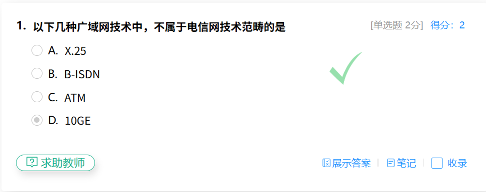
>
> **选择题**：
>
> **以下几种广域网技术中，不属于电信网技术范畴的是 (单选题 2分)**
>
> -  A. X.25
> -  B. B-ISDN
> - C. ATM
> - D. 10GE
>
> **选项分析**：
> X.25、B-ISDN（宽带综合业务数字网）和 ATM（异步传输模式）都是传统的、由电信运营商主导和定义的**电信网络技术**。而 10GE (10 Gigabit **Ethernet**) 是**以太网技术**的延伸，其根源于**计算机网络（尤其是局域网）**，虽然现在也广泛用于构建城域网和广域网，但其技术范畴属于计算机网络而非传统电信网。
>
> **答案选项**：**D**

**简单理解：电信网相关概念**（我认为不会考，因为不是考研408中的内容，但也了解一下）

*   **X.25**：早期商店里的刷卡机通过电话线连接到银行网络进行交易。
*   **B-ISDN** (Broadband **Integrated** Services Digital Network)：通过一根光纤线路同时为家庭提供高清电视、高速上网和电话服务。
*   **ATM** (Asynchronous Transfer Mode)：电信运营商使用的一种技术，它将视频、语音和数据都切分成固定大小的数据包进行高速传输。
*   **10GE** (10 Gigabit Ethernet)：数据中心内部服务器之间使用的高速以太网连接技术，速率达到每秒10G比特。
*   **SDH** (Synchronous Digital Hierarchy)：电信运营商用来在城市之间的光纤干线上，将多路电话和数据信号捆绑在一起进行长距离高速传输。
*   **SONET** (Synchronous Optical Networking)：与SDH类似，主要在北美地区使用的。

---

> 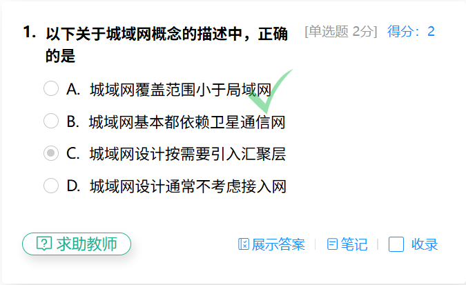
>
> **选择题**：
>
> **以下关于城域网概念的描述中，正确的是 (单选题 2分)**
>
> - A. 城域网覆盖范围小于局域网
> - B. 城域网基本都依赖卫星通信网
> - C. 城域网设计需要引入汇聚层
> - D. 城域网设计通常不考虑接入网
>
> **选项分析**：
> 城域网（MAN）规模介于局域网（LAN）和广域网（WAN）之间，其网络结构通常采用典型的三层模型：**核心层、汇聚层和接入层**。**汇聚层**负责连接多个接入层交换机，进行流量汇聚和策略执行，是城域网设计的关键部分。A 选项范围说反了；B 选项错误，城域网主要依赖**光纤**；D 选项错误，城域网必须考虑如何让用户和局域网接入。
>
> **答案选项**：**C**

**简单理解：城域网三层模型**

*   **接入层**：将你办公室的电脑连接到公司内部的交换机。
*   **汇聚层**：将一栋办公楼内的交换机（接入层）连接。
*   **核心层**：不同办公楼（汇聚层）的交换机连接。

---

> 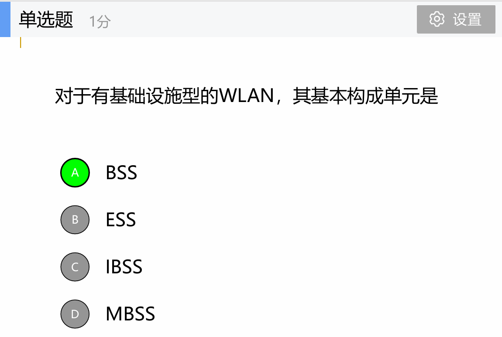
>
> **选择题**：
>
> **对于有基础设施型的WLAN, 其基本构成单元是 (单选题 2分)**
> A. BSS
> B. ESS
> C. IBSS
> D. MBSS
>
> **选项分析**：
> **有基础设施型 (Infrastructure Mode)** 的WLAN是指无线设备通过一个中心接入点（**Access Point, AP**）来通信的网络，这是最常见的Wi-Fi组网方式。**BSS (基本服务集)** 正是由**一个AP**和所有与它关联的无线客户端（如手机、电脑）组成的网络单元。ESS (扩展服务集) 是由多个BSS组成的更大网络；IBSS (独立基本服务集) 是指没有AP的Ad-Hoc自组网模式。因此，BSS是基础设施型WLAN的**最基本构成单元**。
>
> **答案选项**：**A**

---

**简单理解：WLAN基本构成**

*   **BSS (Basic Service Set)**：你家里的那台无线路由器，以及所有连接到它的手机和电脑，共同组成了一个基本的BSS。
*   **ESS (Extended Service Set)**：南开大学教学楼里每层都装有无线AP，这些AP共同组成一个名为`NKU_WLAN`的无线网络，让你可以从一楼走到五楼而网络不中断，这个`NKU_WLAN`就是一个ESS。
*   **IBSS (Independent Basic Service Set)**：在没有网络的地方，两部手机直接开启Wi-Fi Direct功能互传文件，它们之间形成了一个临时的IBSS网络。

---

> 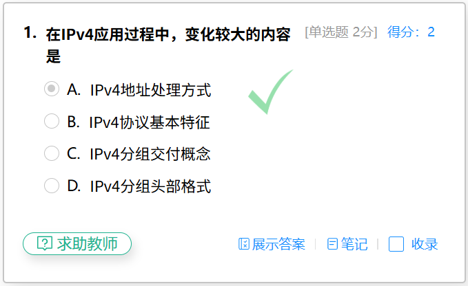
>
> **选择题**：
>
> **在IPv4应用过程中，变化较大的内容是 (单选题 2分)**
>
> - A. IPv4地址处理方式
> - B. IPv4协议基本特征
> - C. IPv4分组交付概念
> - D. IPv4分组头部格式
>
> **选项分析**：
> 为了解决 IPv4 地址耗尽问题，其**地址处理方式**经历了巨大演变：从最初的**分类地址（A/B/C类）**，发展到**子网划分**，再到**无类域间路由（CIDR）**，以及广泛应用的**网络地址转换（NAT）**。相比之下，IPv4 的基本特征、分组交付概念和头部格式为保持兼容性都基本维持不变。
>
> **答案选项**：**A**

**简单理解：IPv4 地址处理方式演变**

*   **A/B/C/D/E类地址**：早期根据IP地址的第一个数字（如1-126为A类）来固定地划分网络部分和主机部分，例如A类地址有8位网络号和24位主机号。
*   **子网划分**：一个公司申请到一个C类网络（254个可用IP），通过借用主机号的几位来划分出多个更小的子网，例如为研发部、市场部各分配一个独立的子网。
*   **CIDR** (Classless Inter-Domain Routing)：使用 `192.168.10.0/23` 这样的斜线记法，灵活地将多个C类地址块合并成一个更大的路由条目，以减少路由表的规模。
*   **NAT** (Network Address Translation)：你家里的多台电脑和手机通过一个路由器共享同一个公网IP地址上网，路由器负责将内部私有IP地址（如192.168.1.101）转换成运营商分配的那个公网IP。

---

> 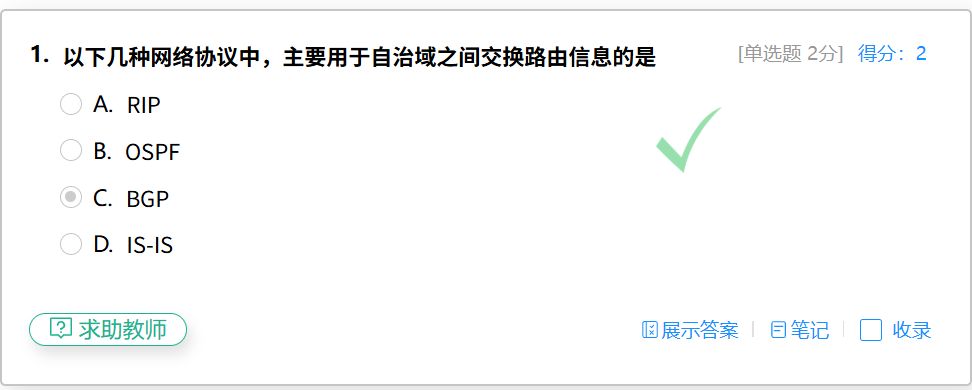
>
> **选择题**:
>
> **以下几种网络协议中，主要用于自治域之间交换路由信息的是 (单选题 2分)**
>
> - A. RIP
> - B. OSPF
> - C. BGP
> - D. IS-IS
>
> **选项分析**:
> 路由协议分为**内部网关协议 (IGP)** 和**外部网关协议 (EGP)**。IGP 在一个**自治系统 (AS)** 内部工作，而 EGP 在不同的自治系统之间交换路由信息。RIP、OSPF 和 IS-IS 都属于 IGP。只有 **BGP (边界网关协议)** 是目前互联网上唯一使用的 EGP，负责在大型网络运营商（如电信和联通）这些不同的自治域之间交换路由信息。
>
> **答案选项**: **C**

---

**简单理解：路由协议与自治系统**

*   **自治系统 (AS)**(Autonomous System)：南开大学的整个校园网可以被看作一个自治系统，由学校的网络中心统一管理其内部的所有路由策略。
*   **内部网关协议 (IGP)**(Interior Gateway Protocol)：在南开大学这个自治系统内部，各学院楼的路由器之间使用 OSPF 协议来相互告知如何到达某个机房或办公室。
*   **外部网关协议 (EGP)**(Exterior Gateway Protocol)：南开大学的校园网（一个AS）与中国教育和科研计算机网CERNET（另一个AS）连接时，它们之间通过 BGP 协议来交换路由信息。
*   **IS-IS** (Intermediate System to Intermediate System)：一个大型互联网服务提供商（如中国电信），在其全国骨干网内部的路由器之间使用 IS-IS 协议来规划数据传输路径。

---

> 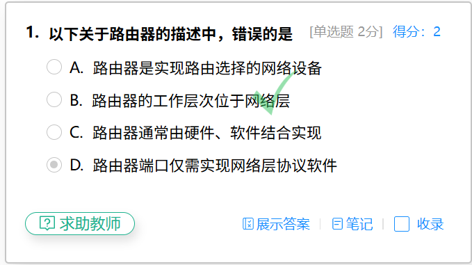
>
> **选择题**:
>
> **以下关于路由器的描述中，错误的是 (单选题 2分)**
> A. 路由器是实现路由选择的网络设备
> B. 路由器的工作层次位于网络层
> C. 路由器通常由硬件、软件结合实现
> D. 路由器端口仅需实现网络层协议软件
>
> **选项分析**:
> 路由器是工作在**网络层**的设备，但它的物理端口要能接收和发送数据，必须实现完整的底层协议栈。这意味着一个路由器的端口至少需要实现**物理层**（处理电信号或光信号）、**数据链路层**（封装和解封装帧）和**网络层**（处理IP包和路由选择）。选项 D 中“**仅需**实现网络层”的说法是错误的，它忽略了物理层和数据链路层。
>
> **答案选项**: **D**

---

**简单理解：网络互联设备**

*   **集线器 (Hub)**：一个老式的网络设备，当一台电脑发送数据时，它会把数据复制并**广播**给所有连接到它的电脑，效率很低。
*   **交换机 (Switch)**：办公室里一个连接多台电脑的盒子，它工作在**数据链路层**，能根据**MAC地址**将数据精确地转发到目标电脑，而不是广播给所有电脑。
*   **路由器 (Router)**：你家里的无线路由器，它工作在**网络层**，连接了你家的局域网和运营商的广域网，并根据**IP地址**决定数据包是发给你手机还是发到互联网上。

*   **AP (Access Point)**：在学校教学楼或商场里，安装在天花板上用来提供**Wi-Fi**信号的白色盒子或圆盘设备。
*   **光猫 (Optical Modem)**：宽带运营商（如联通、电信）安装在你家里的，负责将墙上接口的**光纤**信号转换成路由器可以使用的网络信号的设备。

---

> 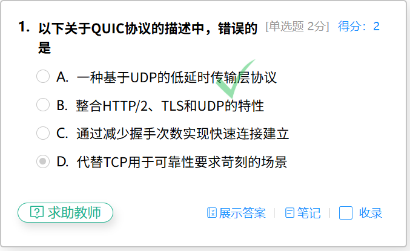
>
> **选择题**:
>
> **以下关于QUIC协议的描述中，错误的是 (单选题 2分)**
>
> - A. 一种基于UDP的低延时传输层协议
> - B. 整合HTTP/2、TLS和UDP的特性
> - C. 通过减少握手次数实现快速连接建立
> - D. 代替TCP用于可靠性要求苛刻的场景
>
> **选项分析**:
> QUIC 是一个基于 UDP 的协议，它在应用层实现了可靠传输、拥塞控制和加密等功能，旨在降低延迟。A、B、C 都是 QUIC 的核心特点。然而，尽管 QUIC 提供了可靠性，但它并非设计用来全面“代替”TCP，尤其是在那些对**数据完整性有极端严格要求、且对延迟不敏感**的传统场景（如银行核心交易、数据库备份）。TCP 经过了几十年的发展和优化，其可靠性机制在操作系统内核层面实现，仍然是这些场景的黄金标准。因此，D 选项的说法过于绝对，是错误的。
>
> **答案选项**: **D**

---

**简单理解：新兴协议与安全**

*   **QUIC** (Quick UDP Internet Connections)：当你用最新版的 Chrome 浏览器访问 Google 或 YouTube 时，数据可能通过QUIC协议传输，它在UDP之上实现了类似TCP的可靠性和HTTPS的安全性，但连接更快，加载视频更流畅。
*   **TLS** (Transport Layer Security)：当你访问银行网站时，浏览器地址栏显示的锁形图标表示正在使用TLS协议对你和银行服务器之间的所有通信内容进行加密。

---

> 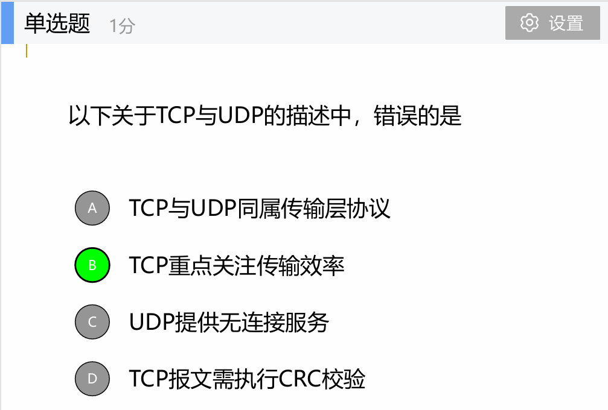
>
> **选择题**：
>
> **以下关于TCP与UDP的描述中，错误的是 (单选题 1分)**
>
> - A. TCP与UDP同属传输层协议
> - B. TCP重点关注传输效率
> - C. UDP提供无连接服务
> - D. TCP报文需执行CRC校验
>
> **选项分析**：
> TCP (传输控制协议) 的核心设计目标是**可靠性**，通过三次握手、确认应答、超时重传等机制来保证数据完整、有序地到达，这些机制会牺牲一定的传输效率。而UDP (用户数据报协议) 则追求**高效率和低延迟**，它不保证可靠性。因此，"TCP重点关注传输效率" 的说法是错误的，这恰恰是UDP的特点。A、C、D均为正确描述（注：TCP的校验和算法并非标准CRC，但具备类似的数据完整性校验功能，在此题中视为正确）。
>
> **答案选项**：**B**

---

**简单理解：TCP/UDP相关概念**

*   **有连接**：打电话时，你必须先拨号、等对方接通（建立连接），然后才能开始通话，通话结束后再挂断（释放连接），这个过程就是面向连接的。**TCP是有连接的。**
*   **无连接**：寄一封平信时，你直接把信投进邮筒就完成了发送，不需要确认对方是否在家或是否能收到，每封信之间也毫无关联，这个过程就是无连接的。**UDP是无连接的。**
*   **CRC校验 (Cyclic Redundancy Check)**：下载一个压缩包文件后，解压软件会进行一次校验，以确保文件在下载过程中没有发生数据损坏。

---

> 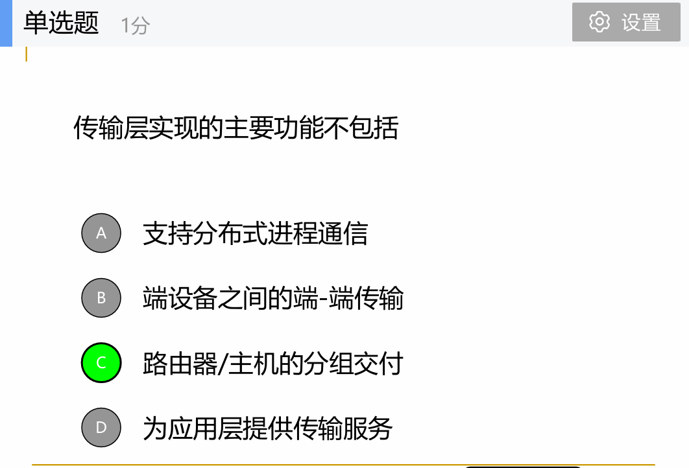
>
> **选择题**：
>
> **传输层实现的主要功能不包括 (单选题 1分)**
>
> - A. 支持分布式进程通信
> - B. 端设备之间的端-端传输
> - C. 路由器/主机的分组交付
> - D. 为应用层提供传输服务
>
> **选项分析**：
> 传输层负责的是**端到端**（End-to-End）的、**进程到进程**（Process-to-Process）的通信。而**路由器/主机的分组交付**，即在网络中根据IP地址进行数据包的路径选择和转发，是**网络层**的核心功能。路由器本身就工作在网络层，不关心传输层的端口号等信息。因此，C选项不属于传输层的功能。
>
> **答案选项**：**C**

---

**简单理解：传输层与网络层功能**

*   **端到端传输**：你用微信给朋友发消息，传输层负责确保这条消息从你手机上的微信程序，完整地送达到你朋友手机上的微信程序（而不是发到Bilibili），而不关心中间经过了多少路由器。
*   **分组交付**：你发送的数据包在互联网上传输时，每个路由器都会检查其目的IP地址，然后决定下一个应该把它转发给哪个路由器，这个逐跳转发的过程就是分组交付。
*   **分布式进程**：你电脑上的微信客户端是一个进程，腾讯服务器上负责处理消息的程序是另一个进程，这两个进程分布在不同的计算机上并通过网络进行通信。

---

> 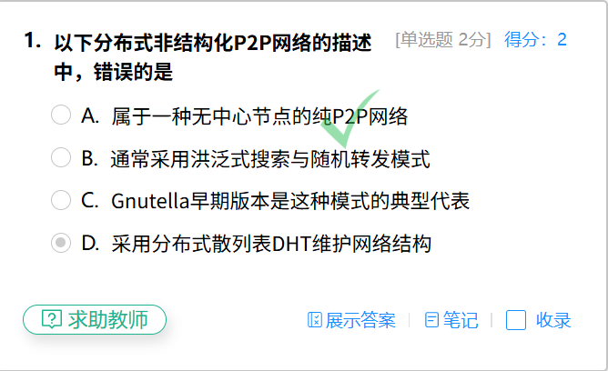
>
> **选择题**:
>
> **以下分布式非结构化P2P网络的描述中，错误的是 (单选题 2分)**
>
> - A. 属于一种无中心节点的纯P2P网络
> - B. 通常采用泛洪式搜索与随机转发模式
> - C. Gnutella早期版本是这种模式的典型代表
> - D. 采用分布式散列表DHT维护网络结构
>
> **选项分析**:
> P2P 网络主要分为非结构化和结构化两种。**非结构化P2P**网络节点随机加入，没有清晰的组织结构，资源查找通常采用**泛洪（Flooding）**方式，如早期的 Gnutella，因此A、B、C正确。而**分布式散列表 (DHT)** 是一种高效的资源定位技术，它为整个网络提供了一种**结构化**的组织方式，是**结构化P2P**网络的典型特征（如 BitTorrent 的 DHT 网络）。将 DHT 用于非结构化P2P网络的描述是错误的。
>
> **答案选项**: **D**

---

**简单理解：P2P网络类型**

*   **非结构化P2P**：在早期的Gnutella网络中，你想找一首歌，你的电脑会向所有相连的邻居节点发送请求，邻居节点再转发给它们的邻居，像洪水一样在网络中扩散。
*   **结构化P2P (DHT)**(Distributed Hash Table)：在使用BitTorrent下载文件时，你的客户端通过DHT技术，可以根据文件的哈希值高效地计算出哪些用户（Peer）拥有你需要的数据块，而不需要盲目地向全网广播询问。

---

> 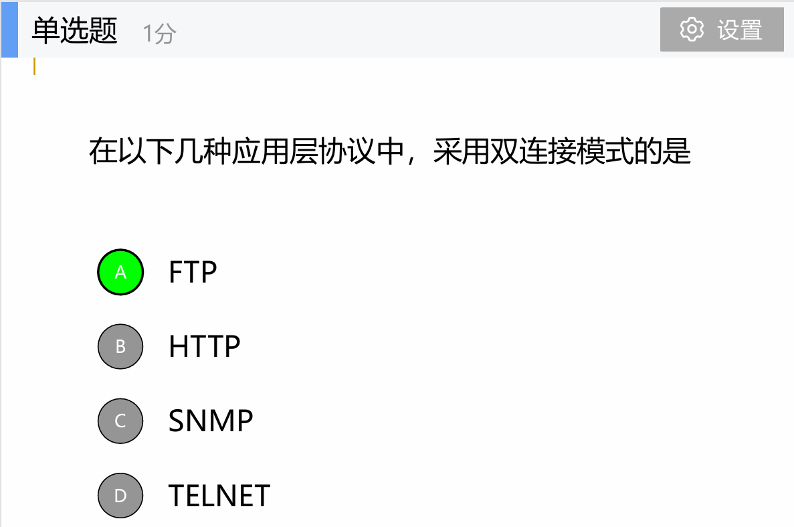
>
> **选择题**：
>
> **在以下几种应用层协议中，采用双连接模式的是 (单选题 1分)**
>
> - A. FTP
> - B. HTTP
> - C. SNMP
> - D. TELNET
>
> **选项分析**：
> 在这些协议中，只有 **FTP (文件传输协议)** 采用了双连接模式。它会建立两条并行的TCP连接：一条是**控制连接**（端口21），用于发送命令（如登录、列出目录、获取文件）和接收服务器的响应；另一条是**数据连接**（端口20或动态端口），专门用于传输文件内容或目录列表。而 HTTP、TELNET 都使用单条TCP连接来传输命令和数据，SNMP 主要基于无连接的 UDP。
>
> **答案选项**：**A**

---

**简单理解：双连接模式**

*   **双连接模式**：使用FTP传输文件时，协议会建立一条专门用来发送命令（如`LIST`查看文件列表）的**控制连接**，和另一条专门用来传输文件内容本身的**数据连接**。

---

> 
>
> **选择题**:
>
> **以下关于域名服务的描述中，错误的是 (单选题 2分)**
>
> - A. 域名服务的应用层协议是DNS
> - B. 解析过程需要按层次查询域名服务器
> - C. 通过主域名查找对应的MAC地址
> - D. 域名数据库可看作分布式数据库
>
> **选项分析**:
> 域名服务（DNS）的核心功能是将人类易于记忆的**域名**（如 `www.nankai.edu.cn`）解析为机器能够识别的 **IP 地址**。而将 IP 地址解析为**MAC 地址**（物理地址）是在局域网内部由 **ARP (地址解析协议)** 完成的。因此，选项 C 描述的功能不属于 DNS，是错误的。A、B、D 都是 DNS 的正确描述。
>
> **答案选项**: **C**

---

> 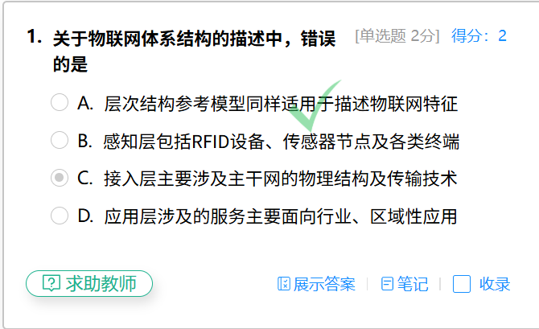
>
> **选择题**：
>
> **关于物联网体系结构的描述中，错误的是 (单选题 2分)**
>
> - A. 层次结构参考模型同样适用于描述物联网特征
> - B. 感知层包括RFID设备、传感器节点及各类终端
> - C. 接入层主要涉及主干网的物理结构及传输技术
> - D. 应用层涉及的服务主要面向行业、区域性应用
>
> **选项分析**：
> 物联网通常被划分为**感知层**、**网络层**（含接入层和核心层）和**应用层**。**接入层**的作用是将感知层设备连接到互联网，类似于“最后一公里”的连接，而**主干网(核心网)**的物理结构及传输技术是由核心层负责的。因此，C 选项将接入层与主干网混淆，是错误的。A、B、D 均是对物联网特征和层级的正确描述。
>
> **答案选项**：**C**

---

**简单理解：物联网体系结构**

*   **物联网 (IoT)**(Internet of Things)：让家里的饮水机、路边的路灯都能联网，实现远程控制。
*   **感知层**：物联网的“眼睛和耳朵”，利用**温度传感器**采集大棚里的数据，或者用 **RFID** 扫一下标签识别货物。
*   **接入层**：物联网设备通过 **Wi-Fi、NB-IoT 或 5G** 连接到运营商的网络，从而把数据**传出去**。
*   **应用层**：针对具体行业的**软件系统**，比如可以根据传感器数据自动调节交通灯的时间。

### 潜在真题：HTTP和DNS协议，递归解析和反复解析

   > 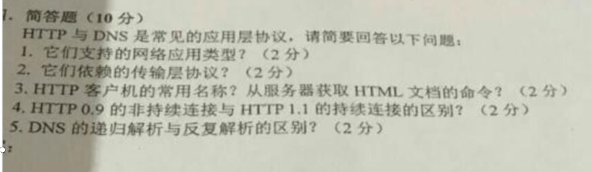
   >
   > **四. 简答题 (10 分)**
   > HTTP 与 DNS 是常见的应用层协议，请简要回答以下问题：
   >
   > 1. 它们支持的网络应用类型？ (2 分)
   > 2. 它们依赖的传输层协议？ (2 分)
   > 3. HTTP 客户机的常用名称？从服务器获取 HTML 文档的命令？ (2 分)
   > 4. HTTP 0.9 的非持续连接与 HTTP 1.1 的持续连接的区别？ (2 分)
   > 5. DNS 的递归解析与反复解析的区别？ (2 分)
   >
   > **简答：**
   >
   > 1.  **网络应用类型**：HTTP 支持**万维网**（WWW/Web）应用；DNS 支持**域名解析**服务。
   > 2.  **传输层协议**：HTTP 依赖 **TCP** 协议；DNS 主要依赖 **UDP** 协议（在大数据传输或区域传送时也使用 TCP）。
   > 3.  **客户机名称与命令**：HTTP 客户机常用名称为**浏览器**（Browser）；获取 HTML 文档的命令是 **GET**。
   > 4.  **连接区别**：非持续连接指**每个请求/响应对都要建立并关闭一个新的 TCP 连接**；持续连接指在**同一个 TCP 连接上可以发送并接收多个请求/响应**，减少了连接建立的开销。
   > 5.  **解析区别**：递归解析中，被请求的 **DNS 服务器代为查询**并返回最终结果；反复（迭代）解析中，DNS 服务器若无结果则**返回下一个应查询的服务器**地址，由**客户端自行发起后续查询**。

---

这道题的存在说明，HTTP的请求方法、版本是必考点，为了将这个必考点一网打尽（顺手把状态码也打了），我写了一个模拟真题：

### 模拟真题：HTTP 协议的请求方法、版本、状态码

> **简答题(10 分)**
>
> 1. 请列举出 HTTP协议中至少4 种**请求方法**。 (4 分)
> 2. 请列举HTTP的至少3个**版本**。(3分)
> 3. 请列举HTTP的至少3个**状态码**。
>
> **简答：**
>
> 1.  **请求方法**：POST/DELETE/PUT/GET/HEAD/OPTIONS。
>     记忆方法：增删改查头选，**增**(POST)**删**(DELETE)**改**(PUT)**查**(GET)**头**(HEAD)**选**(OPTIONS)
> 2.  **版本特征**：
>     *   **HTTP/1.0**：**非持续连接**，每个请求都要新建 TCP 连接。
>     *   **HTTP/1.1**：**持续连接**，一个连接处理多个请求，但存在队头阻塞。
>     *   **HTTP/2.0**：**多路复用**，二进制分帧传输。
>     *   **HTTP/3.0**：基于 **QUIC (UDP)**，彻底解决队头阻塞。
>     *   记忆方法：
>         - 1.0 ：只有一个1，一个连接只处理一个请求。
>         - 1.1： 很多1，一个连接处理多个请求。
>         - 2.0： 2表示分成2份，即分帧传输。
>         - 3.0 ：有3个字母，UDP也有3个字母。
> 3.  **状态码**：
>     *   **200**：请求**成功**。
>     *   **301**：**永久重定向**（搬家）。
>     *   **404**：资源**不存在**（找不到）。
>     *   **500**：服务器**内部错误**（崩溃）。
---

**简单理解：HTTP的6种请求**

*   **POST**：向服务器**提交数据**（如表单、上传文件）。
*   **DELETE**：请求服务器**删除**指定的资源。
*   **PUT**：在指明的一组资源下**存放/替换**一个文档。
*   **GET**：请求读取由 URL 标识的**资源**。
*   **HEAD**：类似于 GET，但服务器仅返回 **HTTP 头部**，不返回正文（用于查看资源状态）。
*   **OPTIONS**：请求服务器告知支持的**通信选项**或能力。

---

**简单理解：HTTP 版本特征**

*   **HTTP/0.9**：最简协议(现在不用了)，只能用 `GET` 读网页文本，**只能看文字**，不能发信息，也没有插图。

*   **HTTP/1.0**：每下载一张网页上的图片都要**重新建立 TCP 连接**，下载完就挂断。
*   **HTTP/1.1**：建立一次连接后可以**连续下载多张图片**(资料)，但必须等上一份资料送到才能要下一份（**队头阻塞**）。
*   **HTTP/2.0**：把资料拆成很多有编号的分片，混在一起发过去（**多路复用**），对方根据编号再组装。
*   **HTTP/3.0 (QUIC)**：不再使用死板的 TCP 协议，改用更灵活的 **UDP**，就算路上掉了一个分片，别的分片也能照常先送到。
*   **首部压缩 (HPACK)**：使用哈夫曼编码压缩首部大小。

---

**简单理解：HTTP 状态码**

*   **200 OK**: 网页请求成功，你顺利看到了南开大学官网首页。
*   **301 Moved Permanently**: 永久重定向。网站搬家了，浏览器会自动跳转到新网址（如 `http` 跳到 `https`）。
*   **403 Forbidden**: 服务器拒绝访问。你没有权限查看这个机密文件夹，哪怕你登录了也没用。
*   **404 Not Found**: 资源不存在。你输入了一个错误的网址，服务器找不到对应的文件。
*   **500 Internal Server Error**: 服务器程序崩溃。你提交表单时后台代码写错了，导致服务器无法处理请求。
*   **503 Service Unavailable**: 服务器超负荷。抢课高峰期，服务器人太多处理不过来，暂时无法响应。

---

### 模拟真题：DNS 递归解析和反复解析的流程图

> **简答题 10分**
>
> 1. DNS 域名系统是一个层次树状结构，请从高到低画出其**3种主要域名服务器**。 (4 分)
> 2. 分别画出在**递归解析**和**迭代解析**(又叫做**反复解析**)中的工作流程？ (6 分)
>
> **简答：**
>
> 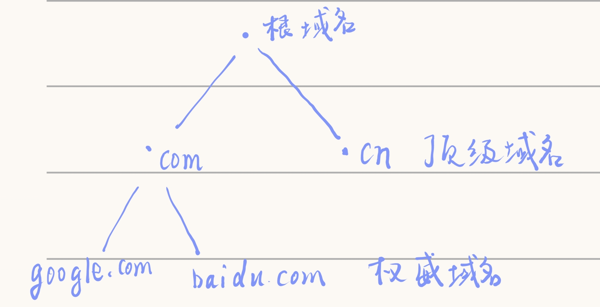
>
> *   `.` 代表根域名，它是所有解析的起点。
> *   `.com` 和 `.cn` 是顶级域名（TLD）。
> *   `baidu.com` 是权威域名。
>
> 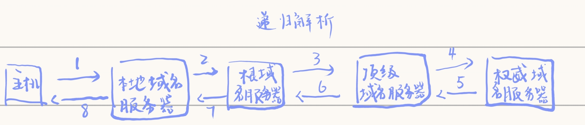
>
> **递归解析**：**接力棒模式/直线形**
>
> 1.  **主机** $\rightarrow$ ① **本地域名服务器**：帮我查一下 `www.nankai.edu.cn`。
> 2.  **本地域名服务器** $\rightarrow$ ② **根域名服务器**：帮我查一下这个域名，查到后再告诉我结果。
> 3.  **根域名服务器** $\rightarrow$ ③ **顶级域名服务器**：帮我查一下这个域名，查到后再告诉我结果。
> 4.  **顶级域名服务器** $\rightarrow$ ④ **权威域名服务器**：请告诉我这个域名的 IP 地址。
> 5.  **权威域名服务器** $\rightarrow$ ⑤ **顶级域名服务器**：查到了，它的 IP 是 `219.243.47.23`。
> 6.  **顶级域名服务器** $\rightarrow$ ⑥ **根域名服务器**：给你，这是刚才那个域名的 IP 地址。
> 7.  **根域名服务器** $\rightarrow$ ⑦ **本地域名服务器**：给你，这是刚才那个域名的 IP 地址。
> 8.  **本地域名服务器** $\rightarrow$ ⑧ **主机**：查到了，IP 是 `219.243.47.23`。
>
> 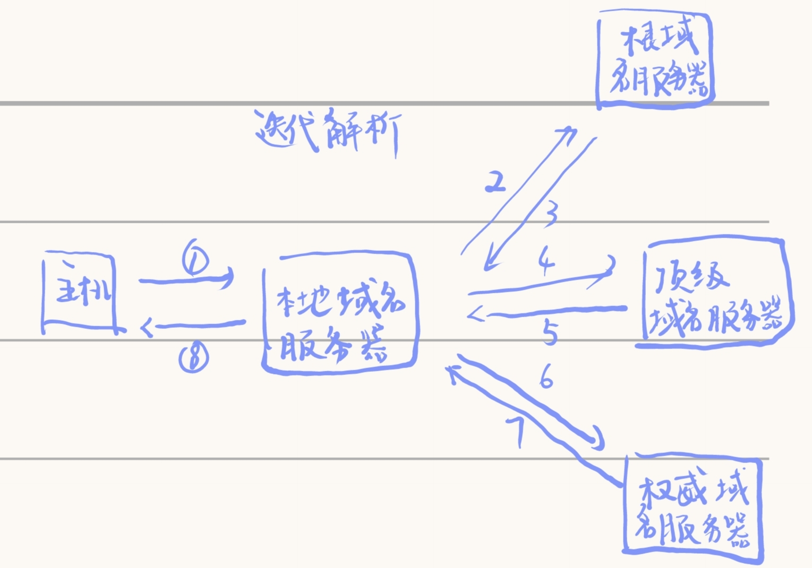
>
> *   **迭代解析**：**指路模式/扇形**
>     1.  **主机** $\rightarrow$ ① **本地域名服务器**：帮我查一下 `www.nankai.edu.cn`。
>     2.  **本地域名服务器** $\rightarrow$ ② **根域名服务器**：你知道这个域名吗？
>     3.  **根域名服务器** $\rightarrow$ ③ **本地域名服务器**：我不知道，但 **顶级域名服务器** 可能知道，它的 IP 是 XXX。
>     4.  **本地域名服务器** $\rightarrow$ ④ **顶级域名服务器**：你知道这个域名吗？
>     5.  **顶级域名服务器** $\rightarrow$ ⑤ **本地域名服务器**：我也不知道，但 **权威域名服务器** 一定知道，它的 IP 是 YYY。
>     6.  **本地域名服务器** $\rightarrow$ ⑥ **权威域名服务器**：请告诉我这个域名的 IP。
>     7.  **权威域名服务器** $\rightarrow$ ⑦ **本地域名服务器**：它的 IP 是 `219.243.47.23`。
>     8.  **本地域名服务器** $\rightarrow$ ⑧ **主机**：查到了，IP 是 `219.243.47.23`。

**简单理解：域名解析**

*   **根域名服务器**：即 `.`。它是最高层次的域名服务器，知道所有顶级域名服务器的 IP 地址。
*   **顶级域名服务器 (TLD)**：如 `.com`、`.cn`、`.edu`。负责管理在该顶级域名下注册的所有二级域名。
*   **权威域名服务器**：如 `nankai.edu.cn`。负责保存该区内所有主机的域名到 IP 地址的映射。
*   **本地域名服务器**：不属于层级结构，代主机完成域名解析。

*   **递归解析 (Recursive)**：接力。本地域名服务器把请求发出去后，后面的服务器像接力棒一样传下去，最后结果传回来。
*   **迭代解析 / 反复解析 (Iterative)**：指路。本地域名服务器每问一个服务器，对方都给它指个路，它得**反复**回来再出发，去问下一个人。

---

### 潜在真题：C/S和P2P协议对比，套接字编程的关键字
> 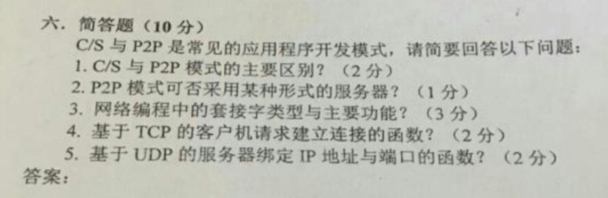
>
> **六. 简答题 (10 分)**
> C/S 与 P2P 是常见的应用程序开发模式，请简要回答以下问题：
>
> 1.  **C/S 与 P2P 模式的主要区别？ (2 分)**
> 2.  **P2P 模式可否采用某种形式的服务器？ (1 分)**
> 3.  **网络编程中的套接字类型与主要功能？ (3 分)**
> 4.  **基于 TCP 的客户机请求建立连接的函数？ (2 分)**
> 5.  **基于 UDP 的服务器绑定 IP 地址与端口的函数？ (2 分)**
>
> **简答：**
>
> 1.  **主要区别**：C/S 模式中，**服务器是固定的**且总是开机，客户端之间不直接通信；P2P 模式中，**任意节点（Peer）之间可以直接通信**，每个节点既是客户端也是服务器，具有高可扩展性。
> 2.  **服务器使用**：**可以**。例如用于辅助定位节点或管理用户信息的**索引服务器**（如 BitTorrent 的 Tracker 服务器）。
> 3.  **套接字类型**：提示：3分答3点。
>     *   **流式套接字 (SOCK_STREAM)**：面向连接，提供可靠的 **TCP** 传输。
>     *   **数据报套接字 (SOCK_DGRAM)**：无连接，提供不可靠的 **UDP** 传输。
>     *   **原始套接字 (SOCK_RAW)**：允许直接访问下层协议（如 IP、ICMP），常用于网络监测。
> 4.  **TCP 连接函数**：**`connect()`**。提示：建立连接的直接翻译，就是connect。
> 5.  **UDP 绑定函数**：**`bind()`**。提示：绑定的的直接翻译，就是bind。

---

**简单理解：应用模式与 Socket 编程**

*   **套接字 (Socket)**：网络编程的接口，就像**一扇门**，应用程序把数据推向这扇门，数据就能通过底层网络传到目的地。
*   **流式套接字 (Stream Socket)**：类似于**打电话**，必须先拨通并建立连接，说话才有序、不丢失。
*   **数据报套接字 (Datagram Socket)**：类似于**寄明信片**，不用等对方接听，直接发出去，但可能丢件或乱序。
*   记忆方法：流式->水流->必须接通水管->TCP。数据报->电报/信件->直接发->UDP。

---

### 模拟真题：Socket 编程的所有经典函数

> **重要提示**：课上老师暗示Socket(套接字)编程必考，而且考C++版本的，如果编程用python，需要记一下C++。考虑到作业确实做过，所以考的概率确实不低。
>
> 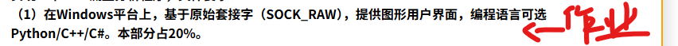
>
> **简答题 (10 分)**
>
> `Socket`编程中，按照通信流程顺序
>
> 1. 列出 **TCP 服务端** 的函数。 (3 分)
> 2. 列出 **TCP 客户端** 的函数。 (2 分)
> 3. 列出 **UDP 服务端** 的函数。 (3 分)
> 4. 列出 **UDP 客户端** 的函数。 (2 分)
>
> **简答：**
>
> 1.  **TCP 服务端**：`socket()` $\rightarrow$ `bind()`  $\rightarrow$ `listen()+accept()`  $\rightarrow$ `recv()/send()` $\rightarrow$ `close()`。
> 2.  **TCP 客户端**：`socket()` $\rightarrow$ `connect()`  $\rightarrow$ `recv()/send()` $\rightarrow$ `close()`。
> 3.  **UDP 服务端**：`socket()` $\rightarrow$ `bind()` $\rightarrow$ `recvfrom()/sendto()` $\rightarrow$ `close()`。
> 4.  **UDP 客户端**：`socket()` $\rightarrow$ `recvfrom()/sendto()` $\rightarrow$ `close()`。

---

**简单理解**：Socket 函数

- 通用函数
  - **`socket`**：创建套接字，可以指定是TCP还是UDP套接字。
  - **`bind`**：将套接字与本地IP和端口号(如8080)绑定。
  - **`close`**：关闭套接字。

* 专用函数

  - TCP专用函数
    - **`listen`**：服务端开始监听客户端的请求。
    - **`accept`**：一般紧接着listen，陷入等待，直到接受客户端的连接请求。
    - **`connect`**：客户端主动连接服务端。
    - **`send`**：TCP版本的发送数据。
    - **`recv`**：TCP版本的接收数据。

  - UDP 专用函数
    - **`sendto`**：UDP版本的发送数据。
    - **`recvfrom`**：UDP版本的接收数据。

记忆方法：一定是`socket()`开始，`close()`结束，服务端`socket()`创建套接字之后需要`bind()`，只需要记忆不一样的部分，可以简化为：

1.  **TCP 服务端**：`listen()+accept()`  $\rightarrow$ `recv()/send()`
2.  **TCP 客户端**：`connect()`  $\rightarrow$ `recv()/send()`
3.  **UDP 服务端**：`recvfrom()/sendto()`
4.  **UDP 客户端**：`recvfrom()/sendto()`

现在就一目了然了，核心操作都是**收**(receive，简写为recv)和**发**(send)，TCP比UDP多了一个**连接**，即`listen()+accept()`和`connect()`。而UDP比TCP多了`from`和`to`，因为没有连接，所以`from()`和`to()`中需要**额外强调**收发的IP和端口号。

---

### 潜在真题：CRC和CheckSum的描述（学长回忆补全版）

> 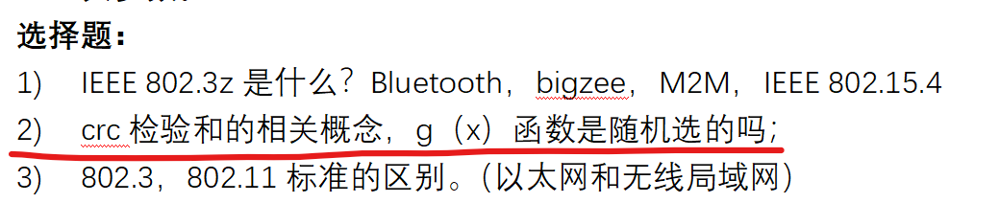
>**选择题**：
> 
> **关于 CRC 循环冗余校验和 Checksum 校验和的描述，错误的是 (单选题 2分)**
>A. CRC 通常在**数据链路**层由**硬件**实现，效率极高
> B. Checksum 主要用于**网络**层 (IP) 和**传输**层 (TCP/UDP)，由**软件**实现
> C. CRC 的生成多项式 $G(x)$ 是根据数学特性精心挑选的标准，而非随机选择
> D. Checksum 的检错能力比 CRC 强，能发现所有位翻转错误
> 
> **选项分析**：
>A、B 描述了两者常见的应用层级和实现方式，正确。C 也是正确的，生成多项式必须满足特定条件（如能整除 $x+1$）才能检测出特定类型的错误（如奇数个位错误）。D 是**错误**的，**CRC 的检错能力远强于 Checksum**。Checksum 采用的是简单的 16 位取反相加，容易出现多个位错误抵消的情况（即“两个错误负负得正”），而 CRC 基于多项式除法，具有极强的数学保证。
> 
> **答案选项**：**D**

---

> **选择题**：
>
> **在 CRC 校验中，生成多项式 $G(x) = x^3 + x^2 + 1$ 对应的二进制比特串是 (单选题 2分)**
> A. 1011
> B. 1101
> C. 111
> D. 1100
>
> **选项分析**：
> 多项式的每一项对应二进制的一位。$x^3$ 对应第 3 位（从 0 开始计），$x^2$ 对应第 2 位，$x^1$（图中没有）对应第 1 位，$1$（即 $x^0$）对应第 0 位。因此：
> $1 \cdot x^3 + 1 \cdot x^2 + 0 \cdot x^1 + 1 \cdot x^0 \Rightarrow 1101$。
>
> **答案选项**：**B**

---

**简单理解：差错检测**

*   **CRC (Cyclic Redundancy Check)**：在网卡硬件里，把一串数据看成一个巨大的数字，除以(用异或运算)一个固定的“幸运数字”，余数就是校验码。
*   **Checksum (校验和)**：把数据拆成一堆 16 位的小段，像算账一样全加起来，最后取个反，简单但不够严谨。
*   **生成多项式 $G(x)$**：对应CRC 里的“除数”。它不是随便选的，是由国际标准组织（如 IEEE）定好的，能确保最大程度发现重传错误。

---

### 模拟真题：CRC与Checksum的计算

> **简答题 (10 分)**
>
> 1.  假设发送端要发送的数据序列为 **101001**。若使用 **CRC 校验**，生成多项式为 $G(x) = x^3 + x^2 + 1$。
>     *   计算应添加在数据后的 **FCS (帧校验序列)**？ (3 分)
>     *   最终发送的**完整帧**是什么？ (1 分)
>     *   简述接收方收到完整帧后如何**校验**？ (1 分)
>
> 2.  假设 TCP/IP 数据报中需要校验的 16 位序列为：**0x4500** 和 **0x003C**。
>     *   使用 **Checksum (校验和)** 算法，计算其**校验和**？ (3 分)
>     *   校验和填写在报文的什么**位置**？ (1 分)
>     *   简述接收方收到报文后如何**校验**？ (1 分)
>
> 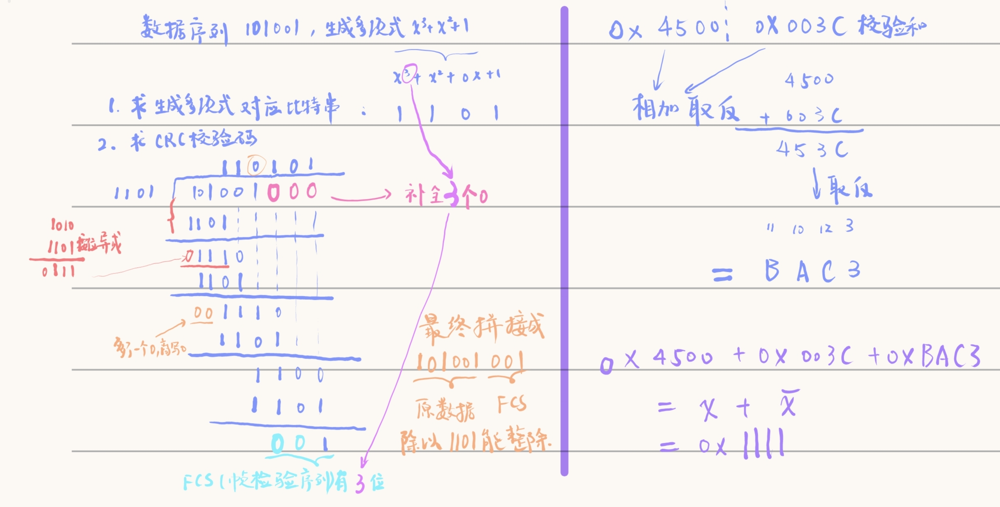
>
> **简答：**
>
> 1.  **CRC 校验**：
>     *   **计算 FCS**：
>         1.  由 $G(x) = x^3 + x^2 + 1$ 得除数为 **1101**。
>         2.  数据后补 3 个 0 得到 **101001000**。
>         3.  进行**模2除法**（异或运算）：`101001000` ÷ `1101`，余数为 **001**。故 FCS = **001**。
>     *   **完整帧**：将 FCS 拼接在原数据后，得到 **101001001**。
>     *   **校验方法**：接收方用相同的除数 **1101** 对完整帧进行模2除法，若**余数为 0** 则校验正确。
>
> 2.  **Checksum 校验**：
>     *   **计算校验和**：
>         1.  **求和**：`0x4500` + `0x003C` = **0x453C**。
>         2.  **取反**：对和的结果按位取反（`F-4, F-5, F-3, F-C`），得 **0xBAC3**。故校验和 = **0xBAC3**。
>     *   **位置**：填写在 IP/TCP/UDP 报文**头部**的校验和字段中。
>     *   **校验方法**：接收方将数据（`0x4500`、`0x003C`）与校验和（`0xBAC3`）**全部相加**，若结果为 **0xFFFF** (全1)，则校验正确。

---

**简单理解：校验进阶**

- **FCS (Frame Check Sequence)**：**帧校验序列**。为了检错而在数据末尾额外添加的比特位，在不同题目中也常被称为 **CRC 码**、**冗余码** 或 **校验位**。

*   **FCS 位数**：生成多项式的**最高指数**是多少，FCS 就要占几位。
*   **完整帧 (Frame)**：数据链路层传输的最终单位，由 **“原始数据”** 后面直接拼接 **“FCS”** 组成。
*   **模2除法**：就是不进位的除法，上下对齐，**相同得0，不同得1**（异或）。
*   **16位分组**：把数据每 **16位**（4位16进制数）分成一组。
*   **反码求和**：发送方“算完取反”，接收方“全加起来”。如果没出错，加起来的结果应该是**全1**。

---

### 潜在真题：要求背出TCP和UDP两大协议的特征

> 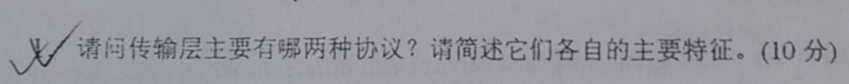
>
> **简答题 (10 分)**
>
> **请问传输层主要有哪两种协议？请简述它们各自的主要特征。**
>
> **简答：**
>
> 传输层主要有两种协议：**TCP**（传输控制协议）和 **UDP**（用户数据报协议）。
>
> **主要特征对比表**：
>
> | 全称   | **TCP** (Transmission Control Protocol) | **UDP** (User Datagram Protocol)            |
> | :----- | :-------------------------------------- | :------------------------------------------ |
> | **连** | **面向连接**（需要三次握手）            | **无连接**（直接发送）                      |
> | **靠** | **可靠**（通过确认、重传机制保证）      | **不可靠**（尽力而为，不保证到达）          |
> | **流** | **字节流**（无固定边界，类似流水）      | **数据报**（保留报文边界，独立分组）        |
> | **控** | 具有**流量控制**和**拥塞控制**          | **无**任何控制机制                          |
> | **快** | **慢**（头部大 20字节，有握手开销）     | **快**（头部小 8字节，无连接延迟）          |
> | **播** | 仅限**一对一**通信                      | 支持一对一、一对多、多对多（**广播/组播**） |
> | **用** | 网页(HTTP)、文件传输(FTP)、邮件(SMTP)   | 视频会议、直播、在线游戏、DNS查询           |
>
> 记忆方法：**连靠流控快播用**，字面意思是：连接靠谱的流量监控，快速播放的应用。

---

**简单理解：流量控制 vs 拥塞控制**

*   **流量控制**：**一对一**。就像漏斗，防止发送端太快，把接收端的缓冲区塞满。
*   **拥塞控制**：**多对一**。就像交通管制，防止全世界的电脑同时发数据，把互联网的交换机和路由器堵死。

**简单理解：各种”播“**

*   **单播 (Unicast)**：你给某个特定的同学发了一条微信私聊消息，只有他一个人能收到。
*   **组播 / 多播 (Multicast)**：你在微信里拉了一个“考研冲刺群”，你在群里发的消息只有**加入该群**的成员能收到，群外的人收不到。
*   **广播 (Broadcast)**：村里的喇叭大喊“下雨了收衣服”，**全村所有人**（同一个局域网内的所有设备）都能听到这个消息。
*   **任播 (Anycast)**：你在全国各地拨打 `110`，网络会自动把你接入到距离你**最近**的那个公安局，而不是全国所有的公安局都响铃。

---

### 潜在真题：Wireshark 报文分析

> 没有找到原题的图片，所以，我按照比较合理的情况，自己补全了图片信息
>
> 假设 Wireshark 捕获到的数据包关键信息如下：
>
> *   **Protocol**: TCP
> *   **Source Port**: 54321, **Destination Port**: 80
> *   **Sequence Number**: 1, **Acknowledgment Number**: 1
> *   **Flags**: 0x010 (ACK)
> *   **Window**: 64240
> *   **Checksum**: 0xafde [unverified]
>
> 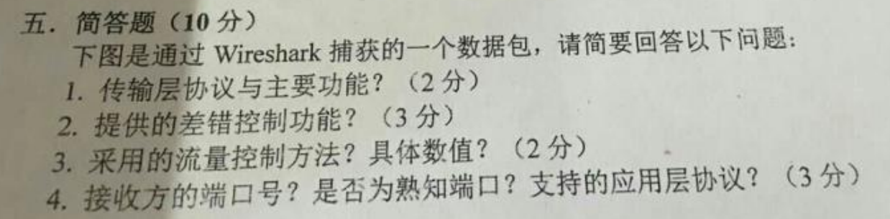
>
> **五. 简答题 (10 分)**
>
> 1.  **传输层协议与主要功能？ (2 分)**
> 2.  **提供的差错控制功能？ (3 分)**
> 3.  **采用的流量控制方法？具体数值？ (2 分)**
> 4.  **接收方的端口号？是否为熟知端口？支持的应用层协议？ (3 分)**
>
> **简答：**
>
> 1.  **协议与功能**：协议是 **TCP** (传输控制协议)。主要功能是提供**面向连接**的、**可靠**的、基于**字节流**的端到端传输服务。
> 2.  **差错控制**：主要通过 **Checksum (校验和)** 检测比特错误、通过 **Sequence Number (序列号)** 和 **Acknowledgment (确认)** 检测丢失或乱序，并配合**超时重传**机制进行修复。
> 3.  **流量控制**：采用 **滑动窗口机制**(Sliding Window ) 。图中具体数值为 **64240** 字节（即接收方当前的接收缓冲区剩余大小）。
> 4.  **端口信息**：接收方端口号是 **80**。它是**熟知端口**（Well-known Port，范围 0-1023）。支持的应用层协议是 **HTTP**。

---

**简单理解：TCP 核心机制**

*   **序列号 (Seq)**：给发送的每个字节都编上号，就像给书的每一页标上页码，防止丢页或顺序搞错。
*   **确认号 (Ack)**：接收方告诉发送方：“我已经收到第 X 字节前的内容了，下一条请从 **X+1** 开始发”。
*   **滑动窗口 (Window Size)**：接收方通过这个值告诉发送方：“我现在的内存**还能装下这么多数据**，你别发太快把我撑爆了”。
*   **熟知端口 (Well-known Ports)**：0 到 1023 号端口，是给经典协议预留的固定号码，比如 80 是网页服务，443 是加密网页，21 是文件传输。

---

### 模拟真题：TCP 三次握手与四次挥手 

> **简答题 (10 分)**
>
> 1.  请描述 TCP **建立连接（三次握手）** 的过程（3分），并说明**为什么不是两次**握手（2分）？
> 2.  请描述 TCP **释放连接（四次挥手）** 的过程（3分），并说明**为什么释放连接需要四次**（2分）？
>
> **简答：**
>
> **1. 三次握手部分：**
> *   **过程描述**：
>     1.  **第一次握手**：客户端发送 **SYN** 报文（请求连接）。
>     2.  **第二次握手**：服务端返回 **SYN + ACK** 报文（同意连接 + 确认）。
>     3.  **第三次握手**：客户端再次返回 **ACK** 报文（确认）。
> *   **为什么不是两次**：
>     如果只有两次握手，一个在网络中滞留的客户端**旧请求**(SYN)到达服务端，服务端回应即建立连接，而客户端此时没有建立连接的意愿，这会导致服务端**资源浪费**。
>
> **2. 四次挥手部分：**
> *   **过程描述**：
>     1.  **第一次挥手**：客户端发送 **FIN** 报文（数据已发完，请求断开）。
>     2.  **第二次挥手**：服务端返回 **ACK** 报文（同意断开）。
>     3.  **第三次挥手**：服务端在完成最后的数据发送后，发送 **FIN** 报文（我也发完了，请求断开）。
>     4.  **第四次挥手**：客户端返回 **ACK** 报文（确认），连接彻底关闭。
> *   **为什么需要四次**：
>     因为 TCP 是全双工的（双向通信）。当客户端要求断开时，仅代表客户端不再发送数据，但服务端**可能还有数据没发完**。服务端需要先回一个 ACK 表示**收到断开请求**，等自己**数据发完**后才能再发一个 FIN。
>
> 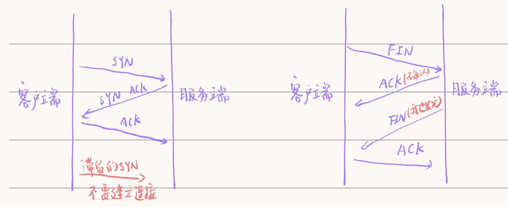
> 记忆方法：
>
> - 三次握手（切两刀）：`SYN` | `SYN  ACK` | `ACK`，形状是对称的，中间的2个单词是服务端
> - 四次挥手（切三刀）：`FIN` | `ACK` | `FIN` | `ACK`，形状是交替的，中间的2个单词也是服务端

---

### 潜在真题：子网掩码、网络地址和广播地址

> 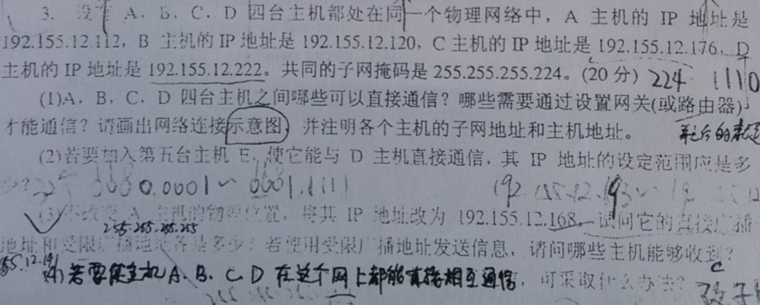
>
> **简答题 (20 分)**
>
> 设 A、B、C、D 四台主机都处在同一个物理网络（如连接在同一个交换机上）中。
> A 主机的 IP 地址是 `192.155.12.112`
> B 主机的 IP 地址是 `192.155.12.120`
> C 主机的 IP 地址是 `192.155.12.176`
> D 主机的 IP 地址是 `192.155.12.222`
> 共同的子网掩码是 `255.255.255.224`。
>
> 1. **哪些主机之间可以直接通信？哪些需要通过设置网关（或路由器）才能通信？请注明各个主机的子网地址。** (6 分)
> 2. **若要加入第五台主机 E，使其能与 D 主机直接通信，其 IP 地址的设定范围应是多少？** (4 分)
> 3. **不改变 A 的物理位置，将其 IP 改为 `192.155.12.168`，其直接广播地址和受限广播地址各是多少？若使用受限广播地址发送信息，哪些主机能收到？** (6 分)
> 4. **若要使 A、B、C、D 在这个网上都能直接相互通信，可采取什么办法？** (4 分)
>
> **题目分析**：
>
> 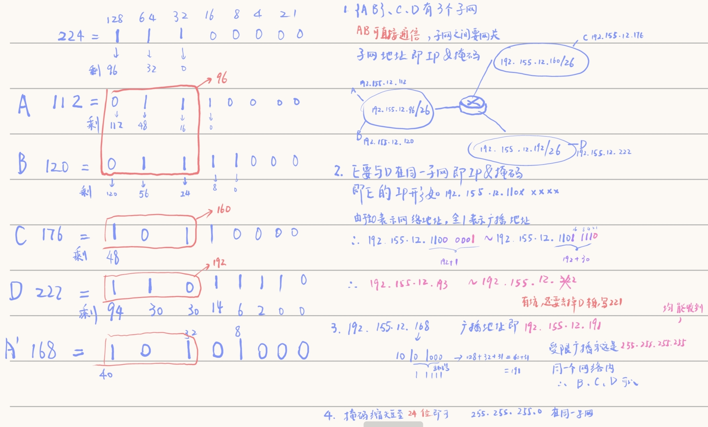
>
> **简答：**
>
> 1.  **直接通信与子网地址**：
>     *   **A 和 B** 可以直接通信（它们都在 `192.155.12.96/27` 子网内）。
>     *   **C 和 D** 以及 **A/B 与 C、D 之间** 需要通过网关才能通信。
>     *   **子网地址**：A、B 为 `192.155.12.96`；C 为 `192.155.12.160`；D 为 `192.155.12.192`。
> 2.  **主机 E 范围**：
>     D 属于子网 `192.155.12.192`。该子网可用主机范围是 `192.155.12.193` ~ `192.155.12.222`。
>     除去 D 本身，E 的范围是 **`192.155.12.193` ~ `192.155.12.221`**。
> 3.  **广播地址与接收范围**：
>     *   新 IP `.168` 属于子网 `192.155.12.160`。
>     *   **直接广播地址**：**`192.155.12.191`**。
>     *   **受限广播地址**：**`255.255.255.255`**。
>     *   **谁能收到**：受限广播不经过路由器，因此同一物理网络上的 **A、B、C、D** 理论上都能在数据链路层收到该帧。
> 4.  **改进办法**：
>     **修改子网掩码**。将其扩大（例如改为 `255.255.255.0`），使所有主机处于同一个逻辑子网内。

---

### 模拟真题：CIDR 与子网划分

> **简答题 (10 分)**
>
> 某公司获得一个 IP 地址块 `202.112.10.128/26`。
>
> 1.  该地址块的**子网掩码**用点分十进制表示是多少？ (2 分)
> 2.  该地址块包含的**最大可用主机数**是多少？ (2 分)
> 3.  该地址块的**网络地址**和**广播地址**分别是什么？ (4 分)
> 4.  如果公司想把该地址块平分成两个子网，每个子网的**新掩码**是多少？ (2 分)
>
> 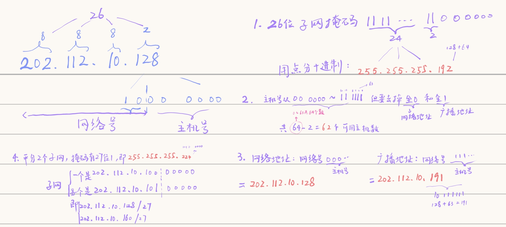
>
> **简答：**
>
> 1.  **子网掩码**：`/26` 表示前 26 位为 1，即 `11111111.11111111.11111111.11000000`。
>     转换得：**`255.255.255.192`**。
> 2.  **可用主机数**：主机位有 $32 - 26 = 6$ 位。总地址数 $2^6 = 64$。
>     减去网络地址和广播地址，可用主机数为 $64 - 2 = $ **62 台**。
> 3.  **地址范围**：
>     *   **网络地址**：**`202.112.10.128`**（主机位全 0）。
>     *   **广播地址**：$128 + 63 = 191$，即 **`202.112.10.191`**（主机位全 1）。
> 4.  **平分子网**：平分意味着从主机位再借 1 位作为网络位。
>     新掩码变为 `/27`，即 **`255.255.255.224`**。

---

### 潜在真题：ABCDE类IP地址与子网划分（学长回忆补全版）

> 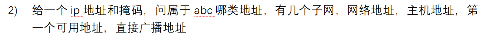
>
> **简答题 (10 分)**
>
> 假设给定一个 IP 地址为 `192.168.10.165`，子网掩码为 `255.255.255.224`。请回答以下问题：
>
> 1.  该 IP 地址属于 **ABCDE 哪类**地址？ (1 分)
> 2.  该子网掩码将原网络划分成了**多少个子网**？ (2 分)
> 3.  该 IP 所在的**网络地址**是多少？ (2 分)
> 4.  该子网的**直接广播地址**是多少？ (2 分)
> 5.  该子网内**第一个可用**的主机地址是多少？ (1 分)
> 6.  该 IP 地址的**主机号**是多少？（相对于网络地址） (2 分)
>
> 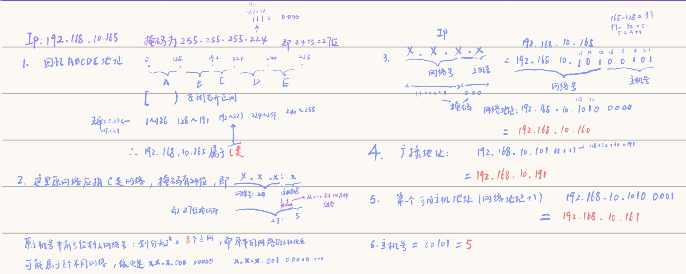
>
> **题目分析**：
>
> 1.  **类别**：`192` 开头，对照表格属于 **C 类**。
> 2.  **子网数**：C 类默认掩码是 `/24` (`255.255.255.0`)。现在的掩码末尾是 `224`，二进制为 `11100000`。
>     *   借了 **3 位** 主机位充当子网位。
>     *   子网数 = $2^3 = $ **8 个**。
> 3.  **计算范围**：
>     *   每个子网的大小 = $2^{(8-3)} = 32$。
>     *   子网区间：`0-31`, `32-63`, `64-95`, `96-127`, `128-159`, **`160-191`**...
>     *   `.165` 落在 `160-191` 这个区间。
>
> **简答：**
>
> 1.  **类别**：**C 类** 地址。
> 2.  **子网数**：**8 个**（$2^3$）。
> 3.  **网络地址**：**`192.168.10.160`**（子网区间的起始点）。
> 4.  **直接广播地址**：**`192.168.10.191`**（子网区间的终点）。
> 5.  **第一个可用地址**：**`192.168.10.161`**（网络地址 + 1）。
> 6.  **主机号**：$165 - 160 = $ **5**（即在该子网内的偏移量）。

---

**简单理解**：

- **ABCDE类地址划分**：就像是砍木棍，第一次把木棍砍成两半，对于后一半，再砍成两半，对于后一半，再砍成两半...

| 类别     | 第一段范围 (十进制) | 第一段格式   | 网络号 / 主机号 | 适用场景             |
| :------- | :------------------ | :----------- | :-------------- | :------------------- |
| **A 类** | **1 ~ 126**         | **0**xxxxxxx | 8位 / 24位      | 大型网络（海量主机） |
| **B 类** | **128 ~ 191**       | **10**xxxxxx | 16位 / 16位     | 中型网络             |
| **C 类** | **192 ~ 223**       | **110**xxxxx | 24位 / 8位      | 小型局域网           |
| **D 类** | **224 ~ 239**       | **1110**xxxx | -               | **组播**（一对多）   |
| **E 类** | **240 ~ 255**       | **1111**xxxx | -               | 科学实验保留         |

**记忆方法**：

- **规律**1：ABCDE 类地址划分中，二进制前几位**1的个数依次增加**，从0，增长到1、11、111、1111，正好有5种。
- **规律**2：如果背下来`0`、`0b1000 0000`、`0b1100 0000`...的数值，也就是**0，128，192，224，240**，248，252，254，255，ABCDE正好是端点和端点之间的**左闭右开区间**。由于`0.0.0.0`表示DHCP分配IP前的地址，而`127.0.0.1`表示**"我自己"**(回环地址)，所以A类地址去掉了0和127，从**1~126**，这样可以直接背下来5类地址范围。
- **规律**2：ABC类的网络号是**8的倍数**，依次是8、16、24，网络大小从大$\rightarrow$中$\rightarrow$小。

---

**简单理解：私有地址**：

*   **私有地址**：在家里或公司内部使用的 IP 地址。这些地址在互联网上是**无效**的，必须通过 **NAT** 转换成公网 IP 才能上网。

| 对应类别     | 私有地址范围                    | 网络号 / 主机号 | 处于类别 | 常见场景          |
| :----------- | :------------------------------ | :-------------- | :------- | :---------------- |
| **A 类私有** | **10**.x.x.x                    | 8位 / 24位      | A 类     | 大型企业内网      |
| **B 类私有** | **172.16**.x.x ~ **172.31**.x.x | 12位 / 20位     | B 类     | 学校或中型公司    |
| **C 类私有** | **192.168**.x.x                 | 16位 / 16位     | C 类     | 家庭 Wi-Fi 路由器 |

**记忆方法:**

- **规律1：**网络号是4的倍数，依次是8、12、16。
- **规律2：**处于的类别依次是A、B、C，网络规模从大->中->小。
- **规律3**：172.16.x.x ~ 172.31.x.x本质山是172.0001xxx.x.x，很像是127.0.0.1

---

### 模拟真题：子网划分大题

> **简答题 (10 分)**
>
> 某单位分配到一个 B 类 IP 地址块 `172.16.0.0/16`。现需要采用**等长子网划分**的方式，将其划分为 **5 个**逻辑子网。请回答以下问题：
>
> 1.  为了满足至少 5 个子网的需求，至少需要从原有的主机位中借**几位**作为子网位？ (2 分)
> 2.  划分后的**子网掩码**是多少（请用点分十进制表示）？ (2 分)
> 3.  在该划分方案下，每个子网可分配的**最大可用主机地址数**是多少？ (2 分)
> 4.  请按从小到大的顺序，列出**前三个子网**的网络地址。 (4 分)
>
> **题目分析：**
>
> 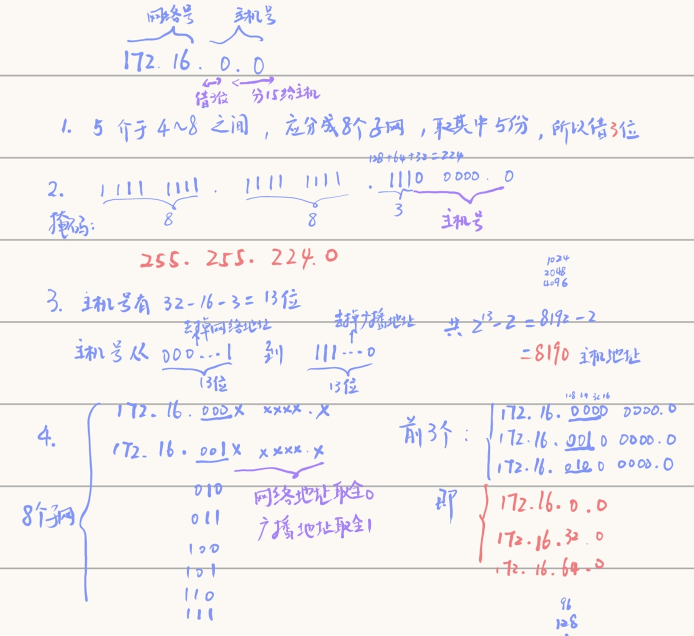
>
> *   **逻辑说明**：题目要求“等长划分”且要“满足 5 个子网”，因为子网数必须是 2 的整数次幂，所以我们实际上会划分出 $2^3 = 8$ 个子网，从中取 5 个使用即可。
>
> **简答：**
>
> 1.  **借位**：因为 $2^2 < 5 \le 2^3$，为了覆盖 5 个子网的需求，至少需要借 **3 位**。
> 2.  **子网掩码**：
>     *   新掩码位数为 $16 + 3 = 19$ 位。
>     *   二进制：`11111111.11111111.11100000.00000000`
>     *   转换点分十进制：**`255.255.224.0`**。
> 3.  **最大可用主机数**：
>     *   剩余主机位：$32 - 19 = 13$ 位。
>     *   计算：$2^{13} - 2 = 8192 - 2 = $ **8190 台**。
> 4.  **子网网络地址**：
>     *   子网块大小（在第三段）：$256 / 2^3 = 32$。
>     *   第一个子网：**`172.16.0.0`**
>     *   第二个子网：**`172.16.32.0`**
>     *   第三个子网：**`172.16.64.0`**

---

**简单理解：等长子网划分**

*   **等长划分 (FLSM)**：像切蛋糕，不管每个部门胃口多大，通通**平均**切成 8 块，你拿走 5 块。
*   **变长划分 (VLSM)**：像按需分配，大部门给一块大的，小部门把剩下的小块再切细。如果在简答题中看到类似 “请给出最高效的 IP 分配方案”才是变长子网划分。 

### 潜在真题：TCP 报文首部分析（学长回忆补全版）

> 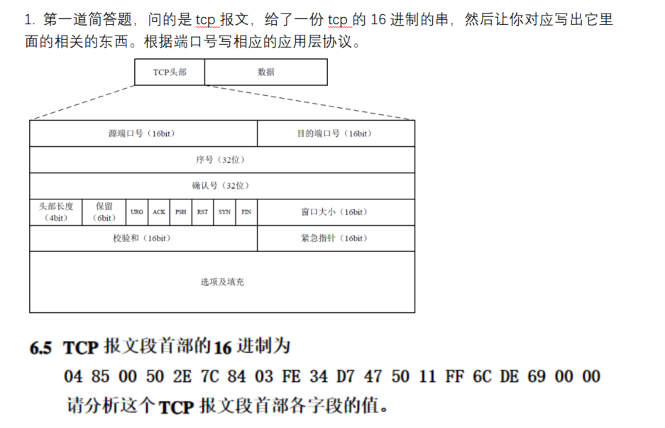
> **简答题 (10 分)**
>
> 假设捕获到一个 TCP 报文段，其首部的 16 进制序列为：
> `04 85 00 50 2E 7C 84 03 FE 34 D7 47 50 11 FF 6C DE 69 00 00`
>
> 请结合 TCP 首部结构图（见下图），分析并回答以下问题：
>
> 1.  **源端口号**和**目的端口号**的 16 进制值分别是多少？对应的十进制值是多少？ (2 分)
> 2.  该报文支持的**应用层协议**是什么？判断依据是什么？ (2 分)
> 3.  该报文的**序号 (Sequence Number)** 和 **确认号 (Acknowledgment Number)** 的 16 进制值分别是多少？ (2 分)
> 4.  该报文的**首部长度**是多少字节？此时 TCP 标志位中的 **ACK** 和 **FIN** 分别为什么状态（0或1）？ (2 分)
> 5.  该报文声明的**接收窗口大小 (Window Size)** 是多少？ (2 分)
>
> 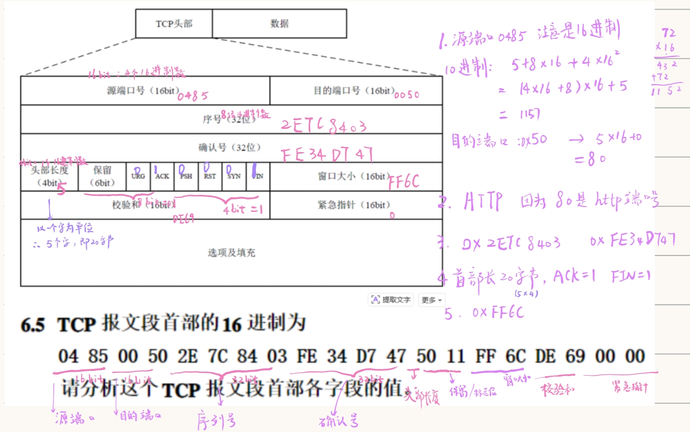
>
> **简答：**（提示，这类题都不需要考虑大小端序，顺着读就完事了）
>
> 1.  **端口号分析**：
>     *   **源端口**：前 2 字节为 `04 85`，十进制为 $4 \times 256 + 8 \times 16 + 5 =$ **1157**。
>     *   **目的端口**：紧接着的 2 字节为 `00 50`，十进制为 **80**。
> 2.  **应用层协议**：
>     *   协议为 **HTTP**。
>     *   依据：目的端口号为 **80**，这是万维网服务（HTTP）的**熟知端口号**。
> 3.  **序号与确认号**：
>     *   **序号 (Seq)**：第 5-8 字节，为 **`2E 7C 84 03`**。
>     *   **确认号 (Ack)**：第 9-12 字节，为 **`FE 34 D7 47`**。
> 4.  **首部长度与标志位**：
>     *   **首部长度**：第 13 字节的前 4 位（Data Offset）为 `5`。计算公式 $5 \times 4$ 字节 $=$ **20 字节**（即该首部无选项字段）。
>     *   **标志位**：第 13、14 字节为 `50 11`。将 `11` 展开为二进制是 `00010001`。
>         对应控制位：`URG=0, ACK=1, PSH=0, RST=0, SYN=0, FIN=1`。
>         故 **ACK = 1**，**FIN = 1**。
> 5.  **窗口大小**：
>     *   第 15-16 字节为 **`FF 6C`**。

---

### 模拟真题：IPv4 报文首部分析 

> **简答题 (10 分)**
>
> 假设捕获到一个 IPv4 数据报，其首部的 16 进制序列前 20 字节如下：
> `45 00 00 3C 1C 46 40 00 40 06 B1 E6 C0 A8 01 64 08 08 08 08`
>
> 请结合 IPv4 首部格式图（见下图）
>
> 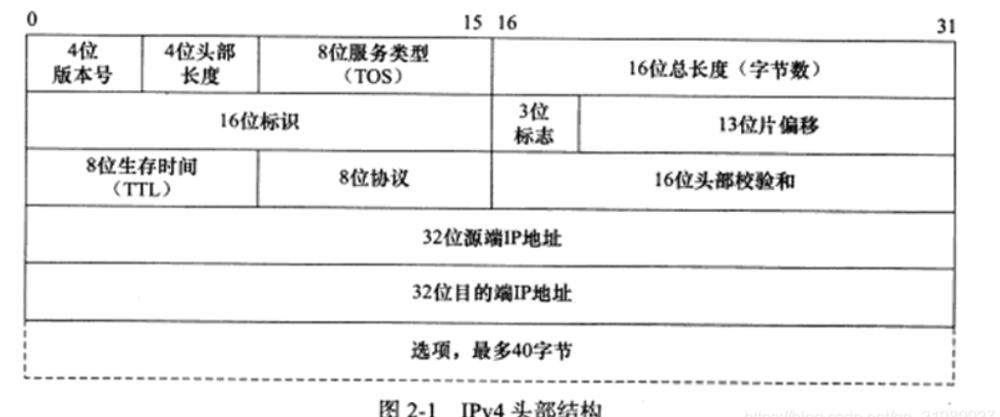
>
> 回答以下问题：
>
> 1.  该报文的**版本号**是多少？**首部长度**是多少字节？ (2 分)
> 2.  该报文的**总长度**是多少字节？其中**数据部分**（有效载荷）长度是多少？ (2 分)
> 3.  根据 **Flags (标志位)** 和 **Fragment Offset (分片偏移)** 字段，判断该报文是否进行了**分片**？其判断依据是什么？ (2 分)
> 4.  该报文的 **TTL (生存时间)** 是多少？如果该报文经过一个路由器转发，该字段会发生什么变化？ (2 分)
> 5.  该报文携带的**上层协议**是什么？**源 IP 地址**是多少（点分十进制表示）？ (2 分)
>
> ---
>
> 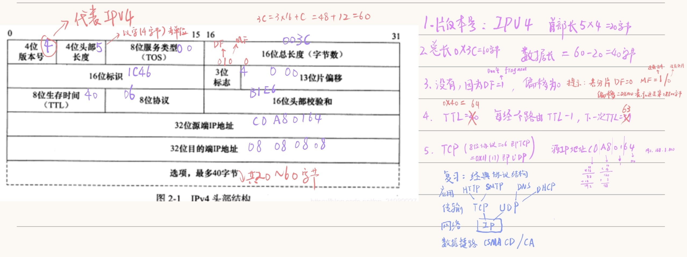
>
> **简答：**
>
> 1.  **版本与首部长度**：
>     *   第 1 字节为 `45`。前 4 位为 `4`，表示 **IPv4**；后 4 位为 `5`，计算为 $5 \times 4 =$ **20 字节**。
> 2.  **长度计算**：
>     *   第 3-4 字节为 `00 3C`，转换十进制为 **60 字节**（总长度）。
>     *   数据部分长度 = 总长度 - 首部长度 = 60 - 20 = **40 字节**。
> 3.  **分片判断**：
>     *   第 7-8 字节为 `40 00`。
>     *   **判断**：**未分片**。
>     *   **依据**：分片偏移量（后 13 位）为 0，且标志位（前 3 位，分别是保留位，DF(Don't Fragment 为1表示不允许分片)，MF(More Fragment为1表示后面还有分片)）中 DF=1，MF=0，说明这是一个不允许分片且完整(后面没有分片)的报文。
>     *   提示：如果分片偏移量=0x100（单位是8字节），表示分片了，并且当前分片位于完整数据的第0x800字节。
> 4.  **TTL 分析**：
>     *   第 9 字节为 `40`，转换十进制为 **64**。
>     *   **变化**：路由器转发时，TTL 值会 **减 1**（变为 63）。若减到 0，报文将被丢弃并向源头发送 ICMP 超时报文。
> 5.  **协议与地址**：
>     *   **协议**：第 10 字节为 `06`，对应 **TCP** 协议。(提示，如果为`0x11`(17)就是UDP协议)
>     *   **源 IP**：第 13-16 字节为 `C0 A8 01 64`。
>         转换：`C0` (192)、`A8` (168)、`01` (1)、`64` (100)，即 **192.168.1.100**。

---

### 潜在真题：以太网帧结构分析（学长回忆补全版）

> 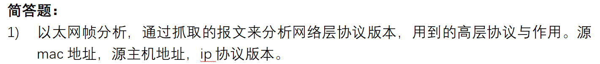
>
> **简答题 (10 分)**
>
> 假设 Wireshark 截获了一个以太网帧，其前 30 字节的 16 进制数据如下（每行 10 字节）：
> `00 0C 29 4F 8B 35  00 0C 29 02`
> `11 F1 08 00 45 00  00 3C 1C 46`
> `40 00 40 06 B1 E6  C0 A8 01 0A`
>
> 请分析该报文并回答以下问题：
>
> 1.  **源 MAC 地址**是多少？ (2 分)
> 2.  以太网帧中的 **类型 (Type)** 字段的值是多少（16进制）？ (2 分)
> 3.  **IP 协议的版本**是多少？你是从哪个字节判断出来的？ (2 分)
> 4.  **源主机的 IP 地址**是多少（点分十进制）？ (2 分)
> 5.  该报文携带的**高层协议**是什么？该协议在网络通信中的主要作用是什么？ (2 分)
>
> 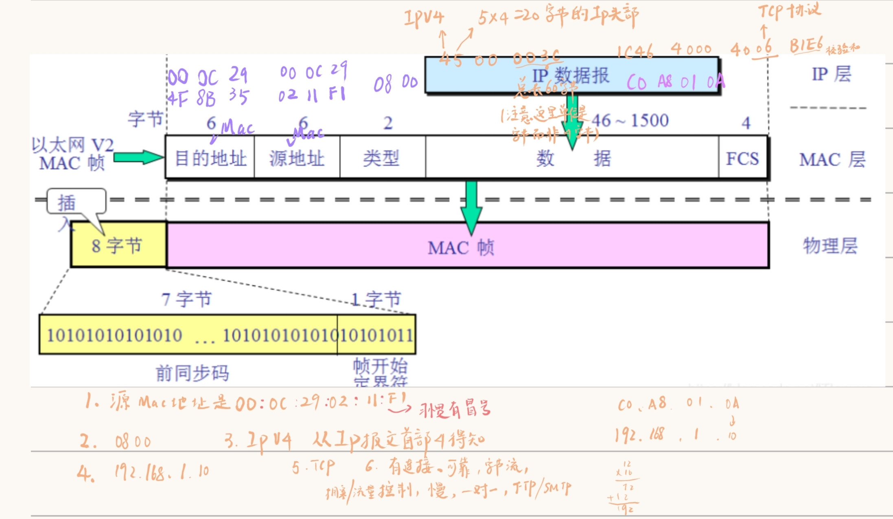
>
> **简答：**
>
> 1.  **源 MAC 地址**：
>     以太网帧的前 6 字节是目的 MAC，接下来的 6 字节是源 MAC。
>     故源 MAC 为：**`00:0C:29:02:11:F1`**。
>
> 2.  **类型字段与网络层协议**：
>     *   **值**：第 13-14 字节，为 **`08 00`**。
>     *   **协议**：代表网络层协议版本是 **IPv4**。
>
> 3.  **IP 版本判断**：
>     *   **版本**：**IPv4**。
>     *   **判断依据**：紧跟在以太网首部之后的第 15 字节（即 IP 报文的第一个字节）为 `45`，其前 4 位是 `4`。
>
> 4.  **源主机 IP 地址**：
>     *   IP 首部中，源 IP 地址位于第 13-16 字节（相对于 IP 首部起点）。
>     *   在该 16 进制串中，对应最后 4 字节：`C0 A8 01 0A`。
>     *   转换得：**`192.168.1.10`**。
>
> 5.  **高层协议与作用**：
>     *   **协议**：IP 首部的协议字段（第 24 字节）值为 **`06`**，对应 **TCP** 协议。
>     *   **作用**：提供**面向连接的、可靠的**字节流传输服务，确保数据无差错、不丢失、不重复地到达。

---

### 潜在真题：FTP、SNMP、POP3协议（学长回忆补全版）

> **重要提示**：考虑到编程作业当中提到了POP3的6种命令，所以考POP3的概率也不低。
>
> 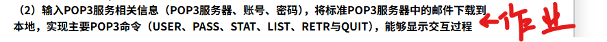
>
> 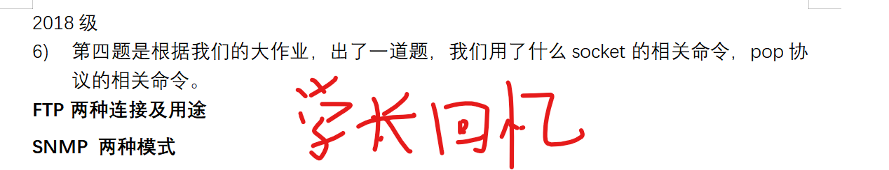
>
> **简答题 (10 分)**
>
> 1.  **FTP 协议**：请说明 FTP 的**两种连接类型**及其各自的端口号和用途。 (4 分)
> 2.  **SNMP 协议**：请说明 SNMP 的**两种工作模式**。 (3 分)
> 3.  **POP3 协议**：请列举出至少 3 个用于邮件读取的 **POP3 命令**。 (3 分)
>
> **简答：**
>
> 1.  **FTP 连接**：
>     
>     *   **控制连接 (Control Connection)(端口 21)**：客户端希望从服务端下载文件前，需要先建立连接，此时会向服务端的21端口发起建立连接请求，服务端接受，就建立了**控制连接**。在整个会话期间**始终保持**控制。
>     *   **数据连接(Data Connection) (端口 20)**：建立连接后，客户端需要下载文件，服务器就通过 20 端口把文件内容源源不断传给客户端，这个连接就叫做**数据连接**。文件传输结束**立即关闭**数据连接。
>     
>     **记忆方法**：数据连接需要传大量数据，是大口的，所以有一个0（20）。而控制连接是小口的，所以有一个1(21)。
> 2.  **SNMP 模式**：
>     
>     *   **轮询 (Polling)**：每隔一段时间，管理软件向网络设备发送请求，主动**轮询**查询设备状态。
>     *   **中断 (Trap)**：当网络设备出现紧急故障时，主动向管理软件发送 **Trap** 报文，实现异常告警。
> 3.  **POP3 命令**：
>     
>     *   **`USER` (User)**：**用户**。用于向服务器提供账户名称。
>     *   **`PASS` (Password)**：**密码**。用于提供与用户名匹配的密码以进行认证。
>     *   **`STAT` (Status)**：**状态**。用于获取邮箱的统计信息（邮件总数和总大小）。
>     *   **`LIST` (List)**：**列表**。用于列出邮件索引号和每封邮件的大小。
>     *   **`RETR` (Retrieve)**：**检索/取回**。用于从服务器获取指定编号的完整邮件内容。
>     *   **`QUIT` (Quit)**：**退出**。用于结束会话并告知服务器进入更新状态（提交删除操作）。
>     
>      **记忆方法**：都是**大写字母**，都含有**4个字母**，其中User、List、Quit本来就**只有**4个字母，不变。Password、Status、Retrieve取**前4**个字母。

---

**简单理解：POP3 交互流程**

*   **第一步（身份验证）**：说我是谁（**`USER`**），并递上身份证（**`PASS`**）。
*   **第二步（查看摘要）**：问问我有几封信（**`STAT`**），然后把所有信概览一遍（**`LIST`**）。
*   **第三步（正式取信）**：把想要的信拿到手里（**`RETR`**）。
*   **第四步（离开提交）**：说声拜拜（**`QUIT`**），把信件拿走，邮局就没有信件了（删除）。

---

### 第一套选择题（25道，50分）

---

> 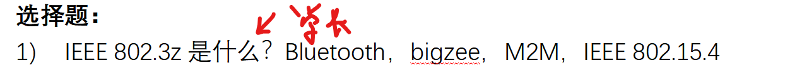
>
> **1.选择题**：
>
> **IEEE 802.3z 标准所定义的网络技术是 (单选题 2分)**
> A. 蓝牙 (Bluetooth)
> B. ZigBee
> C. 千兆以太网 (Gigabit Ethernet)
> D. 低速率无线个域网 (LR-WPAN)
>
> **选项分析**：
> IEEE 802.3 系列标准针对的是**以太网**。其中，**802.3z** 专门定义了通过**光纤**进行传输的**千兆以太网**标准（1000 Mbps）。A 选项蓝牙对应 802.15.1；B 选项 ZigBee 对应 802.15.4；D 选项 LR-WPAN 也是指 802.15.4。
>
> **提示**：本题看似需要记住四种技术的IEEE数字，但是其实只需要知道802.11是无线的（记忆方法：11很像WiFi的两个**i**），802.3是有线的。既然是802.3z，那就是有线的(光纤、以太网)，而蓝牙、无线个域网、ZigBee(智能家居台灯、窗帘)都是无线的。所以排除法选**C**。
>
> **答案选项**：**C**

---

**简单理解 新概念**：

*   **M2M (Machine-to-Machine)**：工厂里的智能水表自动将读数发送给管理服务器，实现**机器与机器**之间无需人工干预的联网通信。
*   **千兆以太网 (Gigabit Ethernet)**：达到每秒 **1000M** 比特的网络。

---

> 
>
> **2.选择题**：
>
> **关于 IEEE 802.3 (以太网) 与 IEEE 802.11 (无线局域网) 标准的区别，描述错误的是 (单选题 2分)**
> A. 802.3 主要用于有线连接，802.11 用于无线连接
> B. 802.3 采用 CSMA/CD 协议，802.11 采用 CSMA/CA 协议
> C. 两种标准物理层传输介质不同，但数据链路层的帧格式完全相同
> D. 802.11 标准需要考虑移动终端的节能和安全性问题
>
> **选项分析**：
> 由于无线环境（信号衰减、隐藏终端等）比有线环境复杂得多，**802.11 的帧格式比 802.3 复杂得多**，两者**并不相同**。A、B、D 描述均正确。再次回顾：802.11是**无线**的(11很像WiFi的两个**i**)，而802.3是**有线**的。因为无线通信更难，所以需要**冲突避免**(Collision Avoidance)，而不只是**冲突检测**(Collision Detection)。
>
> **答案选项**：**C**

- **简单理解**：**无线网面临的挑战**
- **隐藏终端**：两个设备离得太远，互相“听”不到对方，以为信道是空的，结果在中间的接收点**撞车**了。
- **暴露终端**：你听到了邻居在说话，其实你跟他说话的对象不在一个方向，你本可以发信号，但你被他的信号“吓”到**不敢说话**了。

---

> 
>
> 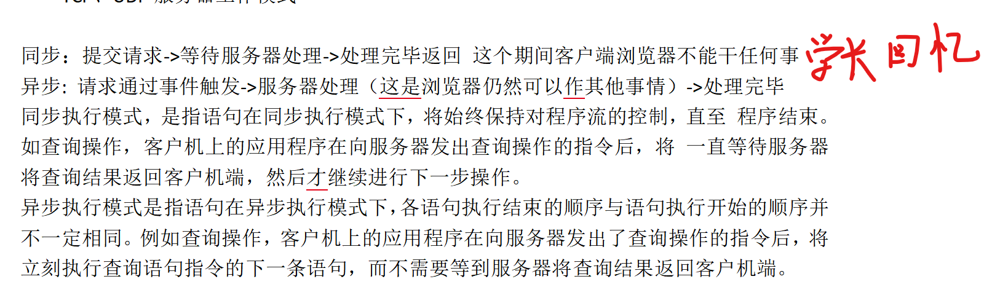
>
> **3. 选择题**：
>
> **在网络应用程序的执行模式中，关于同步与异步的描述正确的是 (单选题 2分)**
> A. **同步执行模式**下，客户机发出查询指令后可以立刻执行下一条语句
> B. **异步执行模式**要求语句执行结束的顺序必须与开始顺序完全相同
> C. **同步执行模式**下，应用程序会保持对程序流的控制，直到服务器返回结果
> D. **异步执行模式**下，客户端浏览器在等待服务器处理时不能进行任何操作
>
> **选项分析**：
>
> *   **同步 (Synchronous)**：意味着“**阻塞/等待**”。程序发出请求后，就像在窗口排队，没领到饭（结果）之前哪也不去，必须等服务器返回，才继续走。故 A 错，C 正确。
> *   **异步 (Asynchronous)**：意味着“**事件触发/非阻塞**”。程序发出请求后，拿个“号”就去干别的了，等服务器处理完通过“事件”通知它。因此，开始顺序和结束顺序不一定一致。故 B、D 错误。
>
> **答案选项**：**C**

---

**简单理解 同步与异步执行**：

*   **同步执行 (Sync)**：**排队买奶茶**。你必须在柜台前死等，拿到奶茶（结果）后，你才能离开去逛街。
*   **异步执行 (Async)**：**扫码点奶茶**。下单后你可以去逛超市（干别的事），等手机震动通知（事件触发），你再回来取奶茶。

---

> 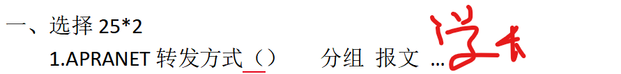
>
> **4.选择题**：
>
> **ARPANET 采用的主要交换方式是 (单选题 2分)**
> A. 电路交换 (Circuit Switching)
> B. 报文交换 (Message Switching)
> C. 分组交换 (Packet Switching)
> D. 虚电路交换
>
> **选项分析**：
> ARPANET 最重大的技术贡献就是打破了传统**电话网**采用的电路交换模式，转而采用**分组交换**（**Packet Switching**）技术。它将长报文切分为一个个较小的“分组”，在网络中独立选择路径传输，这成为了现代互联网的基石。
>
> **答案选项**：**C**

---

**简单理解 交换方式**：

*   **电路交换 (Circuit Switching)**：打老式固定电话，通话期间这根线被你俩**独占**，别人打不进来。
*   **报文交换 (Message Switching)**：像发长电报，整篇内容先传到第一个电报局，**全部存下来**再转发给下一个局，超大报文会**霸占**网络。
*   **分组交换 (Packet Switching)**：把一封"长信"拆成多张"明信片"（**分组**），每张独立邮寄，最后在目的地拼好，互联网就是这么工作的。
*   **多路复用 (Multiplexing)**：多台电脑**共用**一根网线或一个 Wi-Fi 信号，通过**交替发送**各自的"明信片"(数据**分组**)，防止超大报文**霸占**网络。

---

> 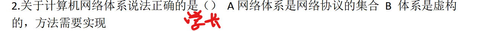
>
> **5.选择题**：
>
> **关于计算机网络体系结构的描述，正确的是 (单选题 2分)**
> A. 网络体系结构是计算机网络协议的**简单**集合
> B. 体系结构是**抽象**的，而协议的具体实现是**具体**的
> C. 所有的网络节点必须实现相同的体系结构和协议实现
> D. 体系结构**仅由**各层协议组成，不包括层间接口
>
> **选项分析**：
> **计算机网络体系结构**是层和协议的**集合**，它是对网络功能的一种**抽象**和规范，定义了网络应该“做什么”。而如何用代码或硬件去完成这些功能则是“实现”。因此，体系结构是虚构/抽象的准则，而**协议实现**才是真正运行的软件。A 选项错在“简单集合”，它还有层间逻辑。
>
> **提示**：这种抽象概念题，如果出现**简单**、**仅由**，这个选项很可能因为过于片面而是错的。
>
> **答案选项**：**B**

---

**简单理解 体系结构**：

*   **网络体系结构 (Network Architecture)**：计算机网络的**理论蓝图**。
*   **协议实现 (Protocol Implementation)**：根据设计图纸真正盖出来的**大楼**。

---

> 
>
> **6.选择题**：
>
> **以下关于 Ad Hoc 网络特征的描述中，错误的是 (单选题 2分)**
> A. 具有自组织、无中心控制节点的特点
> B. 节点通过多跳 (Multi-hop) 方式进行通信
> C. 依赖于预先布设的固定基站或接入点
> D. 网络拓扑结构具有动态变化的特性
>
> **选项分析**：
> **Ad Hoc (自组网)** 的核心是不依赖任何**预设的基础设施**（如路由器或基站）。它是由一群移动节点通过**自组织**方式形成的临时网络。当两个节点距离较远时，需要通过中间节点**多跳**转发。C 选项描述的是有基础设施的网络（如普通 Wi-Fi），不属于 Ad Hoc 的特点。
>
> **答案选项**：**C**

---

**简单理解 移动网络**：

*   **Ad Hoc 网络**：战场上的士兵或灾区的救援队，在没有信号塔的地方，靠各自手里的对讲机互相中转信号形成的**临时自组织**网络。
*   **多跳 (Multi-hop)**：在 Ad Hoc 网络中，A 发给 C 的信息如果太远，需要先发给中间的 B，由 B **中继**转发给 C。

---

> 
>
> **7.选择题**：
>
> **在现代局域网 (LAN) 结构中，处于物理中心位置的常用转发工具是 (单选题 2分)**
> A. 集线器 (Hub)
> B. 交换机 (Switch)
> C. 路由器 (Router)
> D. 网关 (Gateway)
>
> **选项分析**：
> 早期局域网使用集线器（Hub），但它属于广播设备，效率极低。在现代局域网中，**交换机 (Switch)** 是核心设备。它工作在**数据链路层**，能根据 MAC 地址将数据精确地从一个端口转发到另一个端口。路由器通常用于连接不同的网络（局域网和局域网之间的枢纽），而不是局域网内部转发的中心。
>
> **答案选项**：**B**

---

> 
>
> **8. 选择题**：
>
> **Ethernet (以太网) 采用的介质访问控制协议是 (单选题 2分)**
> A. CSMA/CD
> B. CSMA/CA
> C. Token Ring
> D. TDMA
>
> **选项分析**：
>
> 之前分析过很多，应该已经很熟悉了。
>
> **答案选项**：**A**

---

**简单理解：Ethernet vs WLAN**

| 特性 | **以太网 (Ethernet)** | **Wi-Fi (WLAN)** |
| :--- | :--- | :--- |
| **有线？** | **有线** (双绞线、光纤) | **无线** (电磁波) |
| **数字？** | **IEEE 802.3** | **IEEE 802.11**[记忆方法：11像是wifi的两个i] |
| **字母？** | **CSMA/CD** (碰撞**检测**) | **CSMA/CA** (碰撞**避免**)[记忆方法：无线通信更难，要避免冲突] |
| **预约**？ | **不预约，边听边发**，撞了就停 | **发前预约，先听再发**[记忆方法：无线通信更难，要预约信道] |
| **简单理解** | 像在安静房间说话，一旦有人抢话（电压变化），立刻就能察觉并停止。 | 像在嘈杂广场说话，你没法确定远处是否有人同时在说，所以说话前先招手（RTS/CTS）示意。 |

---

> 
>
> **9. 选择题**：
>
> **100BASE-T 标准中，“100”的含义是 (单选题 2分)**
> A. 传输距离为 100 米
> B. 传输速率为 100 Gbps
> C. 传输速率为 100 Mbps
> D. 支持 100 台计算机联网
>
> **选项分析**：
> 在以太网命名规范 `X-BASE-Y` 中：**X** 代表传输速率，**BASE** 指基带传输，**Y** 代表传输介质。**100BASE-T** 中的 100 表示其最高传输速率为 **100 Mbps**（快速以太网）。注意单位是 **M** (Mega) 而非 G。T 代表 **Twisted pair** (双绞线)。
>
> **答案选项**：**C**
>
> **提示**：如果记不住，可以根据常识分析，如果表示的是100米/100台计算机，不合理，很少有标准限定米数和计算机台数的。现在只有100M和100G两个选项，而经常听到广告：百兆宽带，说明百兆是个合理的数字，百G对于网速而言显然太快了。

---

> 
>
> **10. 选择题**：
>
> **标准 Ethernet (以太网) 帧的最大长度为 (单选题 2分)**
> A. 64 字节
> B. 1500 字节
> C. 1518 字节
> D. 2048 字节
>
> **选项分析**：
> 标准以太网帧的**数据载荷 (Payload)** 最大为 1500 字节（即 MTU）。加上帧头（14字节：目的MAC+源MAC+类型=6+6+2）和帧尾（4字节：CRC校验），**整个帧的最大长度为 1518 字节**。如果题目问“数据字段”最大长度则是 1500，问“帧长度”通常指 1518。
>
> **答案选项**：**C**
>
> **提示：**可以回顾之前做过的这道题的结构进行记忆
>
> 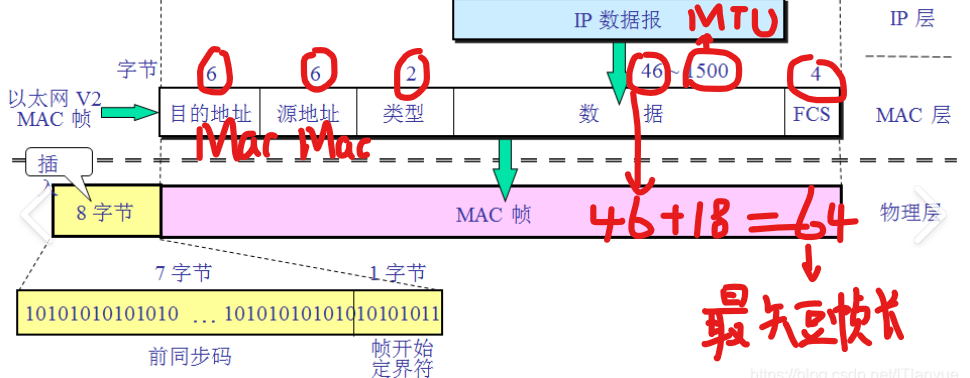

---

**简单理解 帧长度限制**：

- **6 6 2 N 4，收发协数验**：(经典的以太网帧记忆口诀)。以太网帧由 **6** 字节目的 MAC（接**收**方）、**6** 字节源 MAC（**发**送方）、**2** 字节**协**议类型、**可变长度**的**数**据载荷以及 **4** 字节 FCS 校**验**码顺序组成。

*   **MTU (Maximum Transmission Unit)**：指网络层传下来的 **IP 数据报**在数据链路层能容纳的最大体积，通常为 **1500 字节**。
*   **MTU和分组交换的关系**：**分组交换**指的是把"长信"分成"明信片"发送，防止超长报文霸占网络。而**MTU**就描述了这个"明信片"有多长。
*   **最短帧长**：以太网规定最短帧为 **64 字节**。如果你发的数据太短，网卡会自动在后面填满 0（填充位），以确保在信号消失前能检测到碰撞（只发一个比特无法确定是否碰撞）。
*   **最长帧长 (1518 字节)**：为了不让一台电脑长时间独占线路，帧不能太长。数据区（MTU）最大为 **1500 字节**。

---

> **模拟真题：选择题 (2分) **：
> **在一个标准以太网中，若 IP 数据报的长度为 40 字节，则以太网帧的数据字段实际长度和整个帧的长度分别为多少？**
> A. 40, 58
> B. 46, 64
> C. 40, 64
> D. 46, 60
>
> **解析**：由于以太网最短帧限制为 64 字节，数据字段（IP数据报+填充）最小为 46 字节。即使 IP 包只有 40 字节，也会填充到 46 字节。总帧长 = 46 + 18(首尾) = 64。
> **答案选项**：**B**

---

> 
>
> **11. 选择题**：
>
> **谱形连续不断、取值在一定范围内连续变化的信号称为 (单选题 2分)**
> A. 数字信号
> B. 模拟信号
> C. 调制信号
> D. 解调信号
>
> **选项分析**：
> **模拟信号 (Analog Signal)** 的特征是波形随时间**连续变化**，就像波浪一样，可以在一定范围内取任意值。而**数字信号**是离散的，通常只有 0 和 1 两个跳变值。调制信号和解调信号是指经过处理后的信号形态，不属于基础信号分类。
>
> **答案选项**：**B**

---

**简单理解 信号类型**：
*   **模拟信号**：你对着麦克风说话时，产生的电流大小是随声音起伏**连续变化**的，这就是模拟信号。
*   **数字信号**：计算机内部处理数据时，用**高电压代表 1，低电压代表 0**，这种非连续的信号就是数字信号。
*   **调制 (Modulation)**：把电脑里的数字信号（0和1）变成像波浪一样的模拟信号，以便通过电话线或无线电发送出去。好比是把**一颗颗**糖捣碎(调制)为**糖浆**。
*   **解调 (Demodulation)**：把收到的波浪信号还原回电脑能懂的 0 和 1。

---

> 
>
> **12. 选择题**：
>
> **关于电子邮件协议端口号的描述，正确的是 (单选题 2分)**
> A. SMTP 使用 110 端口，POP3 使用 25 端口
> B. SMTP 使用 25 端口，POP3 使用 110 端口
> C. SMTP 使用 80 端口，POP3 使用 443 端口
> D. SMTP 使用 21 端口，POP3 使用 20 端口
>
> **选项分析**：
> **SMTP**（简单邮件传输协议）用于发送邮件，其**熟知端口号为 25**。**POP3**（邮局协议版本3）用于下载邮件，其**熟知端口号为 110**。80/443 是 HTTP/HTTPS 的端口；21/20 是 FTP 的端口。
>
> **答案选项**：**B**

**简单理解 应用层端口**：

**提示**：HTTP=80必须记，但我认为应该不会考太冷门的端口号，但学长回忆里都考了25和110这种端口了，还是记一下吧(重要的加粗)。

| 协议名     | 端口号                     | 记忆方法                                            |
| :--------- | :------------------------- | :-------------------------------------------------- |
| **HTTP**   | **80**                     | 开发过网页的都太熟了，不用记                        |
| **HTTPS**  | **443**                    | **事事善**(指加密后很安全)                          |
| **FTP**    | **21**(控制), **20**(数据) | 0是大**口**，传数据。1是笔尖，控制                  |
| **SMTP**   | **25**                     | **爱我**(指经常和我发邮件是爱我)                    |
| **Telnet** | **23**                     | **爱上**(指远程“上”服务器)                          |
| **POP3**   | **110**                    | **邮局协议**想到警局，**110**                       |
| **IMAP**   | 143                        | **一世生**(指IMAP将邮件保存一辈子，而不是像POP删掉) |
| **DNS**    | 53                         | **五三**(《五年高考三年模拟》，指DNS很常考)         |
| **DHCP**   | 67(Server), 68(Client)     | 67谐音**路由器**（指路由器同时可以充当DHCP服务器）  |
| **TFTP**   | 69                         | **69** 像两个人一起叼着一根糖（微小文件传输）       |
| **SNMP**   | 161(轮询), 162(告警)       | **一路要**（指轮询不断检查）,+1得到告警             |

---

> 
>
> **13. 选择题**：
>
> **关于 IEEE 802.11 (无线局域网) 与 IEEE 802.3 (以太网) 在数据链路层实现机制的对比，描述错误的是 (单选题 2分)**
> A. 802.11 协议在数据链路层采用了确认机制 (ACK)，而 802.3 则不采用
> B. 802.11 帧中包含 4 个地址字段，而 802.3 帧中只包含源地址和目的地址
> C. 802.11 和 802.3 都能通过硬件电压的变化直接检测到冲突是否发生
> D. 802.11 能够通过 RTS/CTS 帧预约信道，解决“隐藏终端”问题
>
> **选项分析**：
> A 描述正确：无线环境干扰大，**802.11 在数据链路层就要求接收方回传 ACK** 以确保单跳可靠性；而 802.3（有线）信号稳定，二层只负责“尽力而为”，可靠性由上层（TCP）负责。
> B 描述正确：由于涉及无线接入点 (AP) 的中转，**802.11 的帧首部预留了 4 个 MAC 地址位**（源、目的、接收端 AP、发送端 AP）。
> C 描述**错误**：这是无线通信的核心痛点。在无线环境下，节点发送信号时自身的信号强度远大于收到的信号，**无法像有线网那样通过电压变化直接监听冲突**。因此 802.11 才被迫采用“碰撞避免 (CA)”而非“碰撞检测 (CD)”。
> D 描述正确：RTS/CTS 是一种可选的信道预约机制，用于通知周围节点“我要说话了”，从而解决隐藏终端问题。
>
> **答案选项**：**C**

---

**简单理解 802.11 的特殊性**：

*   **数据链路层 ACK**：因为空气中干扰多（像在风中传话），每传一句话对方都要回个“收到”，否则就重传。有线网（像拉线电话）很清楚，不用回。
*   **4 个地址**：无线帧有时需要注明：这条信息从哪来、去哪、经过哪个路由器（AP）、发给哪个路由器。
*   **RTS/CTS**：**预约**机制。发大数据前先发个短信号（RTS）问“能发吗？”，对方回个（CTS）说“你发吧，大家保持安静”。

---

> **14. 选择题**：
>
> **C/S (客户机/服务器) 模式与 P2P (对等) 模式工作在 OSI 参考模型的 (单选题 2分)**
> A. 网络层
> B. 传输层
> C. 会话层
> D. 应用层
>
> **选项分析**：
> **C/S 和 P2P** 都是描述应用程序如何组织和通信的**网络应用模式**。既然是为用户提供具体的网络服务（如网页浏览、文件分发），它们理所当然地属于**应用层**。
>
> **提示**：总结应用层协议的时候总结过了。
> 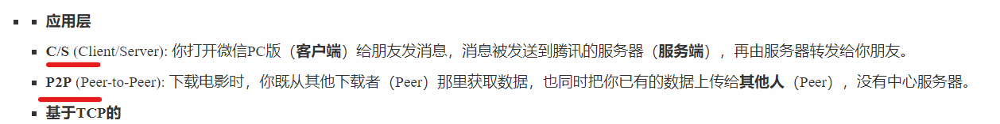
>
> **答案选项**：**D**

---

> 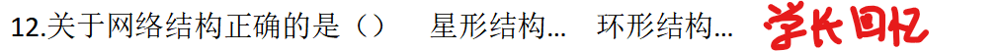
>
> **15. 选择题**：
>
> **关于网络拓扑结构的描述，错误的是 (单选题 2分)**
> A. 星形结构以**交换机**为中心，单点故障不会导致全网瘫痪
> B. 环形结构中，数据沿单一方向传输，容易产生单点故障
> C. 总线形结构由于共用传输介质，通常不存在冲突问题
> D. 网状结构可靠性最高，但布线复杂，常用于广域网核心
>
> **选项分析**：
> **总线形结构**（Bus Topology）所有节点都接在一条主干电缆上，这导致了严重的**冲突问题**，因此必须使用 CSMA/CD 等协议来协调。C 选项说“不存在冲突”是完全错误的。星形结构（A）如果某台电脑坏了，其他电脑照样上网，除非中心交换机坏了。环形结构（B）一旦环路断开，信号就传不下去了。
>
> **答案选项**：**C**

**简单理解 拓扑结构**：
*   **星形 (Star)**：像五角星，中心是交换机。你室友电脑坏了，不影响你打游戏。
*   **环形 (Ring)**：像手拉手围成一圈。只要其中一个人松手，整个圆圈就断了。
*   **总线形 (Bus)**：像一条独木桥，所有人都在桥上走，对面来人必然**撞车（冲突）**。
*   **网状 (Mesh)**：像渔网，路多得是。断掉三五根线，数据依然能绕路到达目的地。

---

> 
>
> **16. 选择题**：
>
> **关于网络各层通信方式的描述，说法正确的是 (单选题 2分)**
> A. 传输层提供的是点对点 (Point-to-Point) 通信
> B. 网络层提供的是端对端 (End-to-End) 通信
> C. 传输层提供的是端对端 (End-to-End) 通信
> D. 数据链路层提供的是端对端 (End-to-End) 通信
>
> **选项分析**：
> *   **端对端 (End-to-End)**：指的是**进程到进程**的通信。只有**传输层**（及以上）能够识别端口号，从而实现两个终端应用程序之间的逻辑通信。
> *   **点对点 (Point-to-Point)**：指的是**主机到主机**或节点到节点的通信。**网络层**、数据链路层和物理层都是基于物理地址或 IP 地址在相邻节点/主机间转发数据，属于点对点范畴。
> A、B、D 的对应关系均错误。
>
> **答案选项**：**C**

---

**简单理解 端对端 vs 点对点**：

*   **点对点**：数据在互联网中像接力赛一样，从你的电脑传给路由器 A，再由 A 传给路由器 B，最后传到百度的**服务器主机**。
*   **端对端**：数据不仅要传到百度的服务器，还要准确地交给服务器上运行的 **Web 端口**（80端口），确保“微信对微信、网页对网页”，不发错程序。

---

> 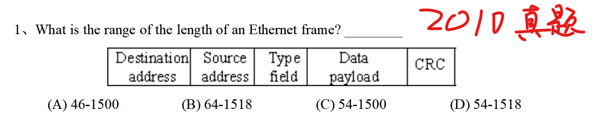
>
> **17. 选择题**：
>
> **以太网帧 (Ethernet Frame) 长度的范围是多少？ (单选题 2分)**
>
> A. 46 - 1500 字节
> B. 64 - 1518 字节
> C. 54 - 1500 字节
> D. 54 - 1518 字节
>
> **选项分析**：
> *   **最小长度 (64字节)**：为了能够检测到冲突，以太网规定了最短帧长。
> *   **最大长度 (1518字节)**：数据载荷最大为 1500 字节（MTU），加上 14 字节首部和 4 字节 CRC 校验，总计 1518 字节。
> *   注意：A 选项 46-1500 指的是**数据载荷字段**（Data Payload）的长度范围。
> *   **提示：**这道题之前总结过，**662N4，收发协数验**，所以要加上18（6+6+2+4）。
>
> **答案选项**：**B**

---

> 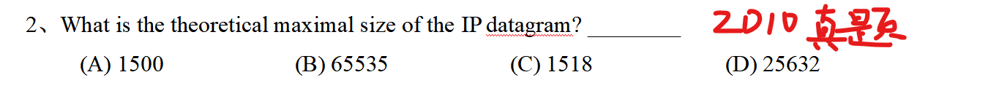
>
> **18. 选择题**：
>
> **IP 数据报 (IP Datagram) 的理论最大长度是多少？ (单选题 2分)**
>
> A. 1500 字节
> B. 65535 字节
> C. 1518 字节
> D. 25632 字节
>
> **选项分析**：
> IP 首部中有一个“总长度”字段，它占据 **16 位**（bit），而且是字节单位的（比如之前大题里的3C就是60字节）。16 位二进制能表示的最大数值是 $2^{16} - 1 = 65535$。因此，一个 IP 数据报的**理论**最大长度（含首部和数据）是 65535 字节。
>
> **答案选项**：**B**

---

**简单理解 长度限制的关系**：

*   **IP 数据报理论最大长度 **：确实可以构造65535字节的IP数据报，但在物理传输时必须切分成多个 1500 字节（MTU）的**分片**。
*   **MSS (Maximum Segment Size)**：TCP 协议为了避免 IP 分片，会主动将数据限制在 **1460** （MSS）字节以内（1460 + 20 TCP头 + 20 IP头 = 1500），使其恰好填满一个以太网帧。

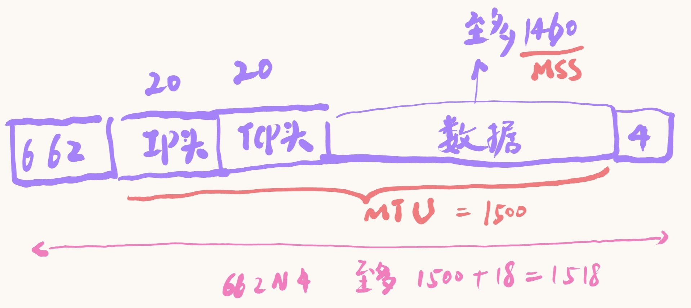

---

> **模拟真题**：**选择题**
>
> **当一个 5000 字节的 IP 数据报通过一个 MTU 为 1500 字节的链路时，至少会被划分为几个 IP 分片？ (单选题 2分)**
>
> A. 3
> B. 4
> C. 5
> D. 6
>
> **选项分析**：
> 每个分片必须包含 20 字节的 IP 首部。
>
> *   每个分片能承载的最大数据量为 $1500 - 20 = 1480$ 字节。
> *   总数据量为 $5000 - 20 = 4980$ 字节。
> *   $4980 / 1480 \approx 3.36$。
> *   向上取整，需要 **4** 个分片。
>
> **答案选项**：**B**
>
> **提示**：详细的分片逻辑如下
>
> *   **分片1**：长度=1500，数据长度=1480, $MF=1$, Offset=0
> *   **分片2**：长度=1500,数据长度=1480， $MF=1$, Offset=185
> *   **分片3**：长度=1500, 数据长度=1480，$MF=1$, Offset=370
> *   **分片4**：长度=560，数据长度=540, $MF=0$, Offset=555
>
> 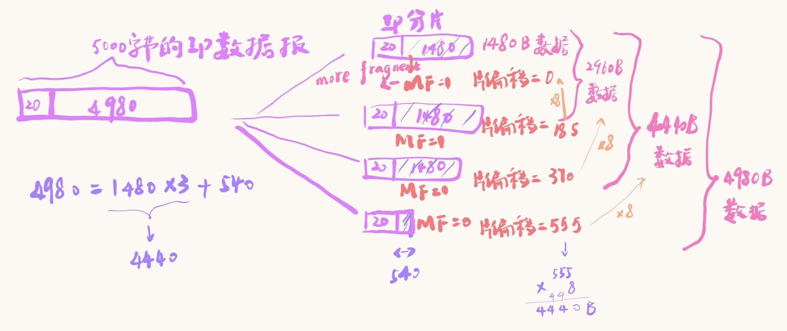

---

> **19. 选择题**：
>
> 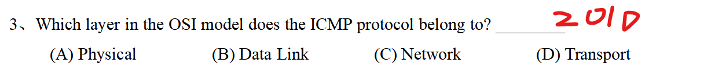
>
> **ICMP 协议属于 OSI 参考模型中的哪一层？ (单选题 2分)**
>
> A. 物理层
> B. 数据链路层
> C. 网络层
> D. 传输层
>
> **提示**：回顾这个图会发现很简单。
>
> 
>
> **选项分析**：
> **ICMP** (网际控制报文协议) 虽然是封装在 IP 数据报内部传输的，但它的主要功能是配合 IP 协议进行差错报告和网络探测（如 `ping` 和 `tracert`），它处理的是 IP 包的交付问题。因此，它被划归为**网络层**（第三层）协议。
>
> **答案选项**：**C**

---

> **20. 选择题**：
>
> 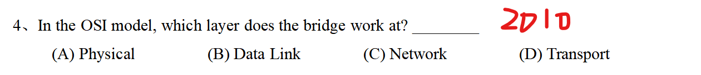
>
> **在 OSI 参考模型中，网桥 (Bridge) 工作在哪一层？ (单选题 2分)**
>
> A. 物理层
> B. 数据链路层
> C. 网络层
> D. 传输层
>
> **选项分析**：
> **网桥**是现代**交换机的前身**。它能够根据 **MAC 地址**来过滤和转发帧，由于 MAC 地址属于物理寻址，处于**数据链路层**（第二层），因此网桥和交换机都工作在这一层。
>
> **答案选项**：**B**

---

- **简单理解**：**网桥**(提示：现在不怎么考了)
- **网桥**: ≈只有两个口的、速度慢的旧式交换机。

---

- **简单理解**：**网络设备对比**

| 特性             | **集线器 (Hub)**                           | **网桥 (Bridge) / 交换机 (Switch)**         | **路由器 (Router)**                          |
| :--------------- | :----------------------------------------- | :------------------------------------------ | :------------------------------------------- |
| **工作层次**     | **物理层** (L1)                            | **数据链路层** (L2)                         | **网络层** (L3)                              |
| **工作原理**     | **盲目广播**。收到信号直接转发给所有端口。 | **定向转发**。根据 **MAC 地址**表精确投送。 | **寻址寻路**。根据 **IP 地址**选择最佳路径。 |
| **隔绝冲突域？** | **否**                                     | **是**                                      | **是**                                       |
| **隔绝广播域？** | **否**                                     | **否**                                      | **是**                                       |

- **简单理解 冲突域与广播域**：
  *   **冲突域**：在同一段线路上，如果两台设备同时发送数据会导致信号互相干扰而无法正常通信的范围。
  *   **广播域**：网络中一台设备发送广播数据包时，所有能够接收到该数据包的设备所处的范围。

>**模拟真题（选择题2分）：**
>
>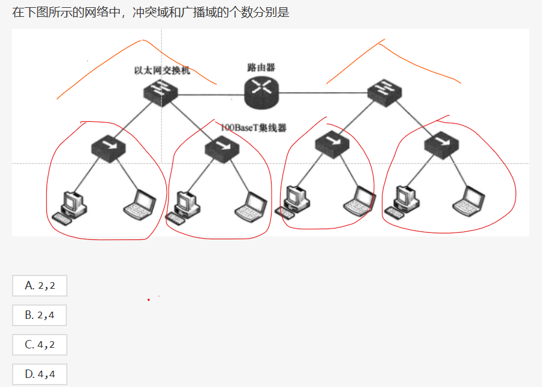
>
>**在下图所示的网络中，冲突域和广播域的个数分别是 (单选题 2分)**
>
>A. 2, 2
>B. 2, 4
>C. 4, 2
>D. 4, 4
>
>* **选项分析**：
>
> *   **冲突域**：一个集线器连接的多台电脑发送任何消息都会被集线器广播，从而产生信号冲突，因此每个集线器及其连接的主机构成一个冲突域。图中共有 4 个集线器区域，即 **4 个冲突域**。
> *   **广播域**：当发送广播数据报时，连接在同一台交换机上的所有设备都能收到，因此每台交换机及其下连设备构成一个广播域。图中由路由器分隔出了 2 个交换机区域，即 **2 个广播域**。
>
> **答案选项**：**C**

---

> **21. 选择题**：
>
> 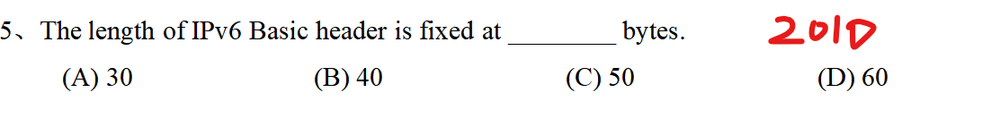
>
> **IPv6 的基本首部 (Basic Header) 长度固定为多少字节？ (单选题 2分)**
>
> A. 30 字节
> B. 40 字节
> C. 50 字节
> D. 60 字节
>
> **选项分析**：
> 与 IPv4 采用 20-60 字节的变长首部不同，**IPv6 为了提高路由器的转发效率，将其基本首部固定为 40 字节**。所有可选功能都被移到了“扩展首部”中。
>
> **记忆方法**：IPv4的长度是20~60字节变长，取平均就是(20+60)/2=40，正好就是IPv6的固定长度。
>
> **答案选项**：**B**

根据您的要求，我已将学长回忆中的 4 道英文题转化为中文选择题，并按照文档格式约定添加到了原文件的末尾。

以下是更新后的补充内容：

---

> 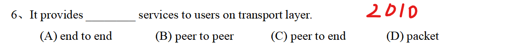
>
> **22. 选择题**：
>
> **传输层 (Transport Layer) 为用户提供的是 (单选题 2分)**
>
> A. 端到端 (End to End) 服务
> B. 点到点 (Peer to Peer) 服务
> C. 点到端 (Peer to End) 服务
> D. 分组 (Packet) 服务
>
> **选项分析**：
> **传输层**联想到微信到微信，所以是端到端。**网络层及以下**联想到主机到主机，所以是点到点。
>
> **答案选项**：**A**

---

> 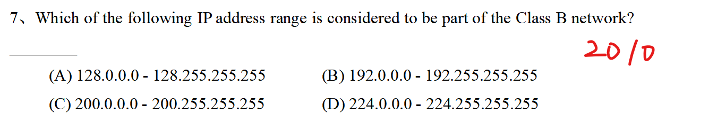
>
> **23. 选择题**：
>
> **以下哪个 IP 地址范围被认为是 B 类网络的一部分 (单选题 2分)**
>
> A. 128.0.0.0 - 128.255.255.255
> B. 192.0.0.0 - 192.255.255.255
> C. 200.0.0.0 - 200.255.255.255
> D. 224.0.0.0 - 224.255.255.255
>
> **选项分析**：
> 根据 **ABCDE 类**地址划分规则：
>
> *   **B 类地址**的第一段范围是 **128 ~ 191**。选项 A 属于此范围。
> *   **C 类地址**的第一段范围是 **192 ~ 223**。选项 B、C 属于此范围。
> *   **D 类地址**（组播）的第一段范围是 **224 ~ 239**。选项 D 属于此范围。
> *   **提示**：直接背出0，128，192，224，240，255，中间的区间对应ABCDE类地址。
>
> **答案选项**：**A**

---

> 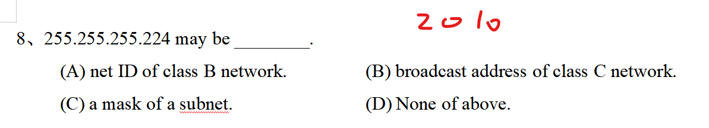
>
> **24. 选择题**：
>
> **255.255.255.224 可能是 (单选题 2分)**
>
> A. B 类网络的网络 ID (Net ID)
> B. C 类网络的广播地址 (Broadcast Address)
> C. 一个子网掩码 (Mask of a Subnet)
> D. 以上都不是
>
> **选项分析**：
> `255.255.255.224` 是一个二进制末尾为 `11100000` 的典型连续全 1 序列，这符合**子网掩码**的特征（对应 CIDR 的 **/27**）。网络 ID 通常是 IP 地址形式（如 172.16.0.0），而 C 类广播地址最后一段通常是全 1（如 .255 或子网划分后的 .31, .63 等），`.224` 明显是一个掩码数值。
>
> **答案选项**：**C**

---

> 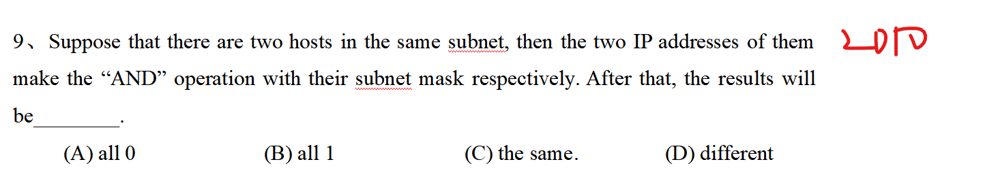
>
> **25. 选择题**：
>
> **假设有两台主机在同一个子网 (Subnet) 中，将它们的 IP 地址分别与子网掩码进行“与 (AND)”运算，其结果将会 (单选题 2分)**
>
> A. 全为 0 (All 0)
> B. 全为 1 (All 1)
> C. 相同 (The same)
> D. 不同 (Different)
>
> **选项分析**：
> **IP 地址与子网掩码进行“与”运算**的数学结果就是该主机所属的**网络地址**（Network Address）。在计算机网络中，判断两台主机是否处于同一个子网的唯一标准就是看它们的**网络地址是否相同**。
>
> **答案选项**：**C**

### 第二套选择题（25道，50分）

> 
